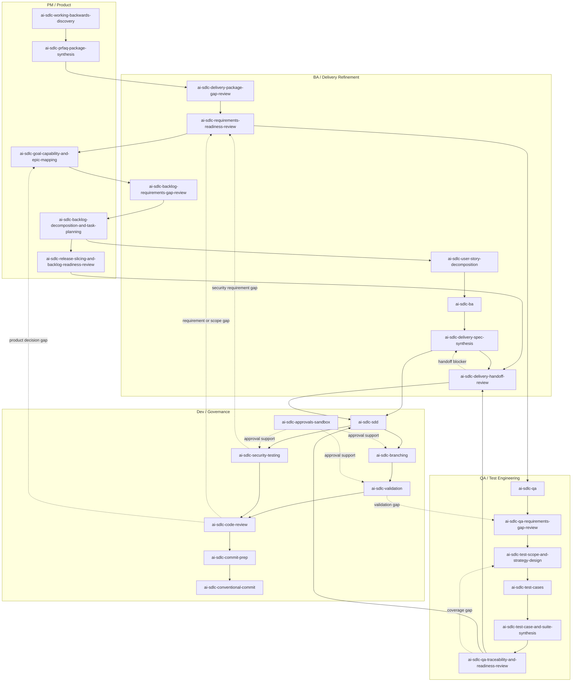

# AI SDLC Skill Library

AI SDLC Skill Library is a set of reusable AI skills for software delivery.

It helps AI assistants work with PM, BA, QA, Delivery, and Dev context in a
structured way: clarify intent, produce delivery artifacts, keep decisions
traceable, generate tests and validation plans, support implementation, and
prepare reviews or commits.

> Positioning: this library is built from real team experience delivering
> software with AI assistants, not from copying another framework. It is not
> external delivery framework, not a external delivery framework-compatible preset, and not yet another external delivery framework, OpenSpec, or
> Spec Kit clone. It is an AI-first SDLC harness for teams that need more than a
> planning prompt or a feature-spec loop: flexible entry from any delivery
> signal, enterprise-grade traceability, decision history, validation evidence,
> and continuity across PM, BA, QA, Delivery, and Dev workflows. Based on our
> experience, this model is the better fit for serious AI-assisted delivery.

## Who It Is For

This repository is for teams that want AI assistants to support real delivery
work instead of only answering ad hoc questions.

It is useful for:

- PMs shaping product intent, PRFAQ, goals, backlog, and release slices;
- BAs turning business context into rules, workflows, assumptions, and
  acceptance criteria;
- QAs planning test scope, test cases, suites, validation, and traceability;
- Developers creating SDD specs, validation plans, reviews, and commit
  readiness;
- Delivery leads keeping handoff, ownership, blockers, and decisions visible.

## What It Contains

- `skills/` - executable skill folders for AI assistants.
- `guides/` - role and workflow guides for PM, BA, QA, and Dev.
- `concepts/` - explanations of the system concepts: artifact routing, flow
  modes, decision logs, state machine, metadata, specs index, scripts, and
  traceability.

Generated project artifacts are expected to live in:

- `specs-refiniment/` for PM, BA, QA, Delivery, and refinement work;
- `specs/` for developer implementation SDD work.

## Why Not external delivery framework, OpenSpec, Or Spec Kit

external delivery framework, OpenSpec, and Spec Kit are useful patterns. This repository is not trying
to prove that they are wrong. It makes a different tradeoff: it optimizes for AI
assistants that repeatedly enter a repository, produce delivery artifacts, read
their own prior context, and continue work across PM, BA, QA, Delivery, and Dev
roles.

This comparison is based on the public project docs:

- [external delivery framework Method docs](https://example.invalid/removed-framework-reference) and
  [workflow map](https://example.invalid/removed-framework-referencereference/workflow-map/);
- [OpenSpec site](https://openspec.dev/);
- [GitHub Spec Kit README](https://github.com/github/spec-kit).

The main differences are about entry point, expected input, artifact model,
repository layout, strictness controls, and how much process state is
machine-readable. The important positioning is flexibility: this library can act
like a lightweight single-skill helper in quick flow, or like an enterprise
traceability and governance harness in full flow.

| Area | external delivery framework Method | OpenSpec | GitHub Spec Kit | AI SDLC Skill Library |
| --- | --- | --- | --- | --- |
| Stated focus | AI-driven agile development with specialized agents, guided workflows, and planning that adapts from bug fixes to enterprise work. | Lightweight spec-driven framework where specs live in the repo and changes produce proposal/design/tasks/spec deltas. | Toolkit for Spec-Driven Development where specs become executable inputs for implementation. | AI-native SDLC skill library for repeated artifact production and consumption across PM, BA, QA, Delivery, and Dev. |
| First user input | Usually a workflow/agent trigger or planning request such as product brief, PRD, architecture, story, or quick-dev intent. | A change intent, commonly via `/openspec:proposal`, which searches existing specs/code and creates a change workspace. | A feature/product prompt via `/speckit.specify`, after project principles are established with `/speckit.constitution`. | Any lifecycle signal: raw notes, PRFAQ, backlog, BA context, QA plan, implementation request, diff, validation output, or commit intent. |
| First repository setup | `npx external delivery framework-method install`, then agents/skills/workflows are available in the target AI tool. | `npm install -g @fission-ai/openspec@latest`; specs and changes are stored under `openspec/`. | `specify init <project>` or `specify init .`, selecting an AI coding agent integration. | `npx skills add mikegorelikoff/ai-sdlc-harness -g --all` or install individual skill folders. |
| Main workflow shape | Four phases: optional analysis, planning, solutioning, implementation, plus quick flow for small work. | Capability specs plus per-change proposal workspace before code. | Constitution -> specify -> plan -> tasks -> implement. | Role workflow: PM shaping -> BA refinement -> QA readiness -> Delivery handoff -> Dev SDD -> validation/review/commit. |
| Main artifacts | PRD, UX/design, architecture spine, stories, sprint/story status, quick-dev specs, project context. | `openspec/specs/<capability>/spec.md` plus `openspec/changes/<change>/proposal.md`, `design.md`, `tasks.md`, and spec deltas. | `.specify/memory/constitution.md`, `specs/<feature>/spec.md`, `plan.md`, `tasks.md`, research/contracts/data model/quickstart depending on phase. | `specs-refiniment/<feature>/...` for upstream PM/BA/QA/Delivery artifacts; `specs/<feature>/...` for Dev SDD, including `plan.toon` and `plan.md`. |
| Artifact routing model | Agent/workflow outputs feed the next phase; context management emphasizes documents becoming context for later agents. | Functional specs are organized by capability; changes are organized separately as reviewable deltas. | Feature folders under `specs/`, with `.specify/` holding templates, scripts, and project memory. | Explicit split between refinement and implementation workspaces, with indexes and decision logs in each workspace. |
| AI context strategy | Structured documents and project context guide later agents; `external delivery framework-help` guides what to do next. | Agent reads capability specs and code to create proposal/design/tasks/deltas; specs persist across sessions. | Agent reads constitution/spec/plan/tasks and uses setup scripts/templates to move through phases. | Agent reads compact TOON first (`specs-index.toon`, `state.toon`, `plan.toon`), then opens selected Markdown only when needed. |
| Sequencing control | Workflow phases, agent triggers, story/sprint flow, and quick-dev/auto-dev options. | Proposal review before code; spec deltas show requirement changes. | Slash commands enforce phase order and prerequisites such as constitution, spec, plan, and tasks. | State-machine gates plus deterministic scripts enforce predecessor stages, quick/full behavior, plan links, validation, and readiness. |
| Strictness control | Workflow choice and quick-dev/auto-dev paths adjust depth. | Lightweight process by default; review depth comes from proposal/spec practice. | Structured command sequence with generated prerequisites. | Explicit `--quick-flow` for fast progress and `--full-flow` for strict questions, upstream checks, validation, and traceability gates. |
| Machine-readable state | Uses workflow/status files where relevant, such as sprint/story status and project context, but the main public docs emphasize workflow documents. | Mostly Markdown specs/change workspaces; public docs emphasize lightweight repo-resident specs and deltas. | `.specify` scripts/templates and generated Markdown artifacts; public docs emphasize command phases and task parsing. | TOON state machines, TOON specs indexes, TOON execution plans, metadata, metatags, and decision-log links are first-class. |
| Traceability model | Phase outputs feed downstream agents; stories and context documents focus implementation. | Spec deltas make requirement changes reviewable and tie proposal/design/tasks to changed capabilities. | Spec, plan, and tasks connect feature intent to implementation; tasks include dependencies, paths, TDD order, and checkpoints. | Cross-role traceability: decisions, metadata, metatags, AC/TC/task links, upstream refinement links, validation sequence, and review/commit gates. |
| Team/process weight | Broad and comprehensive; good when teams want an AI agile operating method with specialized agents. | Lightweight; good when teams want minimal process and living capability specs in repo. | Structured SDD; good when teams want feature specs, plans, tasks, and implementation commands. | Scale-adaptive: one skill can be used independently, while full-flow enables enterprise-grade lifecycle state, handoffs, decisions, and validation across roles. |

Use this library when the problem is not only "write a feature spec", but "let
AI enter from any delivery signal and still preserve lifecycle context". The
design assumes the AI is both producing and consuming the artifacts, so Markdown
is kept for people and TOON is used for compact machine-readable continuity.
The same repository can support quick one-step assistance, strict enterprise
handoff gates, or anything in between.

Use a lighter approach when the team only needs a single feature spec, a small
change proposal, or a one-off planning conversation. external delivery framework is a stronger fit when
the team wants a broad agile agent-method. OpenSpec is a stronger fit when the
team wants lightweight repo-resident capability specs and change deltas. Spec Kit
is a stronger fit when the team wants a focused spec -> plan -> tasks ->
implementation loop. AI SDLC Skill Library is the stronger fit when the team
needs both flexibility and governance: the same feature may enter through PM,
BA, QA, Dev, Delivery, validation, review, or commit prep, and the AI still
needs to preserve state, decisions, links, and validation evidence across
multiple sessions.

## Skill Workflow



## Install With Skills CLI

Install all skills globally:

```bash
npx skills add mikegorelikoff/ai-sdlc-harness -g --all
```

Install one skill:

```bash
npx skills add mikegorelikoff/ai-sdlc-harness/skills/<skill-name> -g
```

Run a skill without installing it permanently:

```bash
npx skills use mikegorelikoff/ai-sdlc-harness@<skill-name>
```

Open the Skills CLI:

```bash
npx skills
```

## Start Here

- [guides/workflow.md](guides/workflow.md) - end-to-end AI-ready delivery
  workflow.
- [guides/pm.md](guides/pm.md), [guides/ba.md](guides/ba.md),
  [guides/qa.md](guides/qa.md), [guides/dev.md](guides/dev.md) -
  role-specific guides.
- [concepts/README.md](concepts/README.md) - how the underlying system works.
