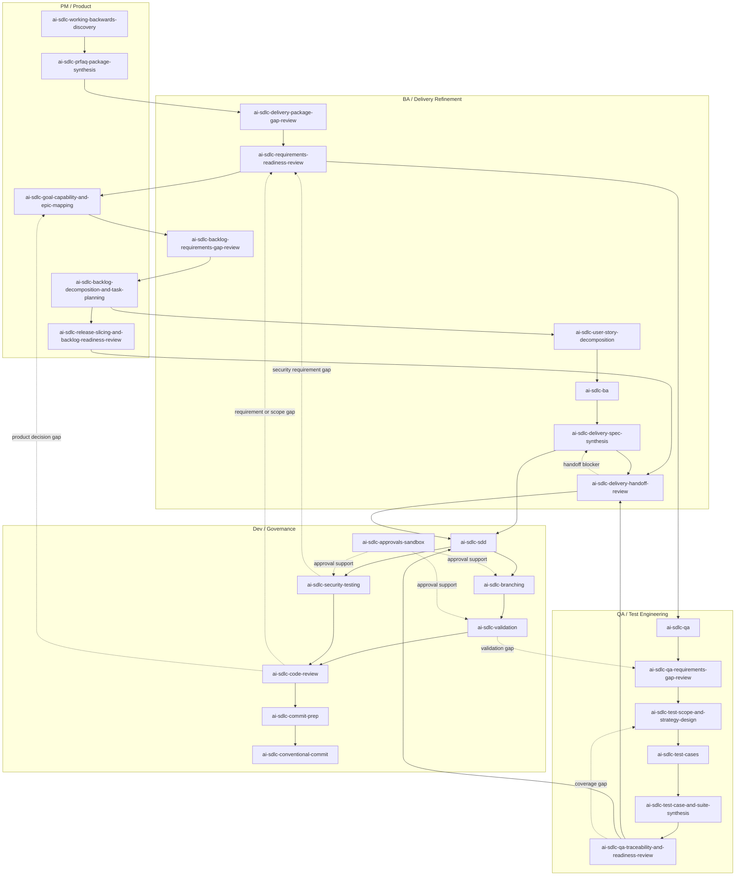

# AI SDLC Skill Library

Agent-agnostic, domain-agnostic AI SDLC skills for traceable software delivery.

This repository gives AI assistants a practical operating layer for PM, BA, QA,
Delivery, and Dev work: clarify intent, produce delivery artifacts, preserve
decisions, generate tests and validation plans, support implementation, and
prepare reviews or commits. The skills are plain repository artifacts, so they
can be used by different AI assistants, agent runners, and internal workflows.

> Positioning: this library is built from real team experience delivering
> software with AI assistants, not from copying another framework. It is not
> external delivery framework, not a external delivery framework-compatible preset, and not yet another external delivery framework, OpenSpec, or
> Spec Kit clone. It is an AI-first SDLC harness for teams that need flexible
> entry points, traceability, decision history, validation evidence, and
> continuity across real delivery workflows.

## Table Of Contents

- [Install](#install)
- [Private Repository Access](#private-repository-access)
- [Quick Start](#quick-start)
- [Why Teams Use It](#why-teams-use-it)
- [How The Harness Works](#how-the-harness-works)
- [Role Coverage](#role-coverage)
- [Artifact Workspaces](#artifact-workspaces)
- [Flow Modes](#flow-modes)
- [Core Concepts](#core-concepts)
- [Comparison](#comparison)
- [FAQ](#faq)
- [Start Here](#start-here)

## Install

Install all skills globally:

```bash
npx skills add mikegorelikoff/ai-sdlc-harness -g --all
```

Install one skill:

```bash
npx skills add mikegorelikoff/ai-sdlc-harness/skills/<skill-name> -g
```

Run one skill without installing it permanently:

```bash
npx skills use mikegorelikoff/ai-sdlc-harness@<skill-name>
```

Open the Skills CLI:

```bash
npx skills
```

## Private Repository Access

If this repository is private, configure GitHub access before running
`npx skills`. Use one of the standard Git authentication paths for the machine
or agent environment:

- SSH key with read access to `mikegorelikoff/ai-sdlc-harness`;
- GitHub CLI login with `gh auth login`;
- HTTPS credential helper or token with repository read access.

## Quick Start

1. Install all skills with `npx skills add ... -g --all`.
2. When the next workflow is unclear, start with the context-aware navigator:

   ```bash
   npx skills use mikegorelikoff/ai-sdlc-harness@ai-sdlc-navigator
   ```

3. The navigator inspects installed skills, branch and feature state, then
   reports one required action, optional actions, exact invocations, expected
   artifacts, and blockers. You can also pick a role or workflow directly from
   [guides/](guides/).
4. Use a matching skill directly when you already know the workflow, for example:

   ```bash
   npx skills use mikegorelikoff/ai-sdlc-harness@ai-sdlc-sdd
   ```

5. For fast work, use the skill's `--quick-flow` behavior when available.
6. For auditable work, use `--full-flow` so the assistant checks decisions,
   upstream artifacts, traceability, and validation evidence.

## Why Teams Use It

AI coding assistants lose leverage when delivery context is scattered across
tickets, chats, meeting notes, specs, PRs, test plans, and tribal knowledge.
This library turns that fragmented context into reusable delivery artifacts.

Use it when your team needs AI to:

- enter from any delivery signal, not only from a clean feature spec;
- preserve PM, BA, QA, Delivery, and Dev context across sessions;
- make decisions traceable instead of buried in chat history;
- keep requirements, tests, tasks, validation, review, and commits connected;
- reduce rediscovery when another AI session or teammate continues the feature;
- support both lightweight assistance and stricter enterprise governance.

## How The Harness Works

The harness combines role skills, helper scripts, routed artifacts, and compact
machine-readable indexes.

- Skills define role-specific AI behavior for PM, BA, QA, Delivery, and Dev.
- `ai-sdlc-navigator` provides a read-only entry point that recommends the next
  required and optional actions from repository evidence.
- Helper scripts handle repetitive scaffolding, validation, indexing, and state
  checks so AI spends fewer tokens rediscovering context.
- For generated Markdown, AI sends only section content through stdin; scaffold
  scripts own headings, metadata, routing, file writes, and finalization.
- `decision-log.md` captures why important choices were made.
- Every workflow returns the versioned `ai-sdlc-handoff/v1` result, blockers,
  and required or optional next actions directly in the assistant response.
- `_ai_sdlc/state.toon`, `_ai_sdlc/specs-index.toon`, and
  `_ai_sdlc/plan.toon` give AI compact continuity across sessions.
- Profile scripts keep Markdown for people and can emit bounded
  `ai-sdlc-context/v2` TOON packs with exact evidence locations and targeted
  follow-up reads for agents.
- Markdown stays readable for humans; TOON files stay cheap for AI to inspect.
- Default and full refinement context and generated artifacts are bounded at
  24,000 estimated tokens per file; quick context uses a 4,000-token budget.
- Legacy paths are read during the v0.4 transition and safely migrated on the
  next write. Divergent legacy/canonical files block instead of overwriting.

## Role Coverage

| Role | What AI Helps Produce |
| --- | --- |
| PM | Discovery notes, PRFAQ package, goal/capability maps, backlog slices, release readiness. |
| BA | Business context, requirements readiness, user stories, acceptance criteria, delivery specs. |
| QA | QA plans, gap reviews, test strategies, test cases, test suites, traceability reviews. |
| Delivery | Handoff reviews, blocker visibility, ownership checks, readiness signals. |
| Dev | SDD packages, branch plans, validation plans, code reviews, security reviews, commit readiness. |

## Artifact Workspaces

Generated project artifacts are routed by lifecycle stage:

- `specs-refiniment/` stores upstream PM, BA, QA, Delivery, discovery,
  refinement, readiness, and handoff artifacts.
- `specs/` stores developer implementation SDD artifacts.

The split matters because refinement context and implementation context change
for different reasons. AI can consume refinement artifacts as upstream evidence
without mixing them into implementation-owned SDD packages.

## Flow Modes

- `--quick-flow`: fast, assumption-driven progress. The assistant avoids
  unnecessary questions, uses documented defaults, and records important
  assumptions.
- `--full-flow`: strict, question-driven, validated progress. The assistant
  checks upstream artifacts, decisions, traceability, gates, and validation
  evidence before handoff.

Use quick flow for low-risk movement. Use full flow when work needs auditability,
handoff confidence, or enterprise-grade delivery control.

## Core Concepts

The `concepts/` folder explains how the harness works for teams and maintainers.
It is not a mandatory runtime checklist for every AI task. Operational behavior
lives in the selected skill, helper scripts, state files, and workspace indexes.

- [Artifact Routing](concepts/artifact-routing.md) explains where generated
  artifacts belong and why `specs-refiniment/` is separate from `specs/`.
- [System Model](concepts/system-model.md) explains architecture layers,
  authority, invariants, data flow, consistency, and recovery.
- [Refinement Lifecycle](concepts/refinement-lifecycle.md) documents the full
  18-stage cascade, predecessor graph, resume rules, and SDD handoff.
- [Context And Quality Gates](concepts/context-and-quality.md) explains source
  resolution, context snapshots, 24k budgets, and tiered finalization gates.
- [Migration And Concurrency](concepts/migration-and-concurrency.md) explains
  legacy-path safety, atomic writes, locks, and interrupted-write recovery.
- [Artifact Metadata And Metatags](concepts/artifact-metadata.md) explains
  searchable frontmatter, tags, trace fields, and update triggers.
- [Decision Log](concepts/decision-log.md) explains auditable decisions,
  assumptions, evidence, affected artifacts, and validation links.
- [Feature State Machine](concepts/feature-state-machine.md) explains
  `state.toon`, lifecycle sequencing, predecessor checks, and skip rules.
- [Flow Modes](concepts/flow-modes.md) explains `--quick-flow` and
  `--full-flow`.
- [Specs Index](concepts/specs-index.md) explains `specs-index.toon` and
  `specs-index.md` for feature discovery.
- [Skill Anatomy](concepts/skill-anatomy.md) explains `SKILL.md`,
  `references/`, `scripts/`, and `tests/`.
- [Token-Saving Scripts](concepts/token-saving-scripts.md) explains how scripts
  take over repetitive scaffolding, validation, indexing, and formatting.
- [Traceability](concepts/traceability.md) explains how artifacts, decisions,
  metadata, AC IDs, TC IDs, tasks, validation, and state files connect.
- [Workflow Handoff](concepts/workflow-handoff.md) defines the common result,
  blocker, and next-action response contract.

## Comparison

external delivery framework, OpenSpec, and Spec Kit are useful. This library makes a different
tradeoff: it optimizes for AI assistants that repeatedly enter the same delivery
context and must preserve state, decisions, and validation evidence across PM,
BA, QA, Delivery, and Dev.

Sources: [external delivery framework Method docs](https://example.invalid/removed-framework-reference),
[OpenSpec](https://openspec.dev/), and
[GitHub Spec Kit](https://github.com/github/spec-kit).

| Area | external delivery framework Method | OpenSpec | GitHub Spec Kit | AI SDLC Skill Library |
| --- | --- | --- | --- | --- |
| Best fit | Broad AI agile agent method. | Lightweight living specs and change deltas. | Focused spec -> plan -> tasks -> implement loop. | Flexible AI SDLC lifecycle with traceability and reusable context. |
| Entry point | Agent/workflow trigger, PRD, story, architecture, quick-dev intent. | Change intent and proposal workspace. | Feature prompt after project constitution. | Any lifecycle signal: notes, PRFAQ, backlog, QA plan, diff, validation, review, commit. |
| State model | Workflow and project-context documents. | Repo-resident specs and change folders. | Generated feature specs, plans, and tasks. | TOON state, specs indexes, execution plans, metadata, decision logs. |
| Strictness | Workflow-dependent. | Lightweight by default. | Structured command sequence. | Explicit quick/full flow across skills and scripts. |

## FAQ

- Is this external delivery framework? No. It is not external delivery framework, not a external delivery framework preset, and not a external delivery framework clone.
- Is it domain-specific? No. It is domain-agnostic and focuses on software
  delivery workflow structure.
- Do small changes need full flow? No. Use quick flow or a single focused skill
  when strict governance is unnecessary.
- What is TOON for? Compact AI-readable continuity: state, indexes, and plans.
- Where do artifacts go? Refinement artifacts go to `specs-refiniment/`;
  implementation SDD artifacts go to `specs/`.

Read the full [FAQ](FAQ.md).

## Skill Workflow



## Start Here

- [guides/workflow.md](guides/workflow.md) - end-to-end AI-ready delivery
  workflow.
- [guides/pm.md](guides/pm.md), [guides/ba.md](guides/ba.md),
  [guides/qa.md](guides/qa.md), [guides/dev.md](guides/dev.md) -
  role-specific guides.
- [concepts/README.md](concepts/README.md) - how the underlying system works.
