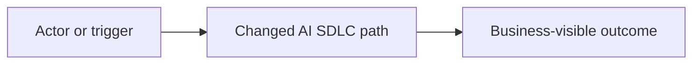
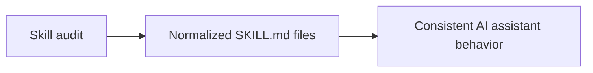

# `ai-sdlc-conventional-commit`

AI SDLC Conventional Commit workflow. Use when an AI assistant drafts, validates, reviews, or fixes commit messages in this repository, especially when commits must include SDD spec references, validation summaries, or safe conventional commit subjects. Supports `--quick-flow` for fast assumption-driven execution and `--full-flow` for question-driven verified execution.

| Lifecycle position | Primary owner | Supporting roles | Module | Output |
| --- | --- | --- | --- | --- |
| Commit message drafting | Dev | PM, BA, QA | `core` | Conventional Commit subject/body with traceability and validation summary |

## Why it exists

Draft, validate, or repair an AI SDLC commit message that uses Conventional Commit syntax and includes SDD, business, implementation, testing, and validation traceability when the change is medium or large.

## Use it when

AI SDLC Conventional Commit workflow. Use when an AI assistant drafts, validates, reviews, or fixes commit messages in this repository, especially when commits must include SDD spec references, validation summaries, or safe conventional commit subjects. Supports `--quick-flow` for fast assumption-driven execution and `--full-flow` for question-driven verified execution.

If the correct entry point is still unclear, ask the read-only navigator first instead of guessing.

## Do not use it when

- Do not use it to stage files or prove scope and readiness. Use `ai-sdlc-commit-prep` instead.


## Who is involved

- **Accountable/primary:** Dev.
- **Supporting:** PM, BA, QA.
- **Agent:** follows this contract, reports assumptions and blockers, and cannot accept protected decisions for the humans above.

## Before you start

- Change type, scope, and implementation summary.
- Spec, validation, and test evidence when applicable.
- Breaking-change or migration details if any.

## Tell your agent

```text
Use ai-sdlc-conventional-commit for <target>.
Choose --quick-flow for bounded assumption-driven progress or --full-flow
for strict verification only as described below.
Read the required evidence,
produce or report Conventional Commit subject/body with traceability and validation summary, preserve human approval boundaries,
and return blockers plus a complete ai-sdlc-handoff/v1.
```

This is an agent instruction, not a shell command. Terminal commands belong in the helper section.

## What the agent reads

- Collect the intended change type: `feat`, `fix`, `docs`, `test`, `refactor`, `chore`, `ci`, `build`, `perf`, or `revert`.
- Collect the optional scope when it adds useful precision, for example `api`, `bitgo`, `sdd`, `skills`, or `docs`.
- Collect the active spec folder for medium or large work, for example `specs/177-skill-instruction-upgrade`.
- Collect the implementation summary, reviewer-visible test path, and exact validation commands with outcomes.
- Collect breaking-change details when behavior, schema, API contract, migration requirements, or compatibility changes are not backward compatible.

## What it may write

- Maintain a feature decision log whenever this skill records, resolves, changes, or depends on a product, delivery, QA, security, validation, branching, implementation, or rollout decision.
- For PM, BA, QA, Delivery, discovery, planning, refinement, and readiness work, write decisions to `specs-refiniment/<feature-name>/decision-log.md`.
- For developer implementation SDD work, write decisions to `specs/<feature-name>/decision-log.md`.
- Each decision-log entry must include date, decision, context or evidence, options considered when relevant, owner, status, and links to affected artifacts, tasks, tests, or validation evidence.
- Use this exact decision-log structure:

  ```markdown
  # Decision Log

  | ID | Date | Status | Owner | Decision | Context/Evidence | Options Considered | Affected Artifacts | Validation/Trace Links |
  | --- | --- | --- | --- | --- | --- | --- | --- | --- |
  | DEC-001 | YYYY-MM-DD | proposed / accepted / superseded / rejected | role or name | concise decision | source facts, artifact links, or evidence | option A; option B; recommended default | affected docs, tasks, code, tests, or rollout notes | requirement IDs, test IDs, validation commands, PRs, commits, or tickets |
  ```

- Use `specs/` only for developer implementation SDD packages and repo-governance artifacts.
- Do not place PM, BA, QA, Delivery, discovery, planning, refinement, or readiness outputs in `specs/`; those belong at `specs-refiniment/<feature-name>/<file.md>`.
- When consuming `specs-refiniment/<feature-name>/<file.md>`, treat it as upstream refinement context and create or update `specs/` only when implementation work is explicitly in scope.

## Human checkpoints

- Ask concise questions before finalizing when role, artifact, requirements, scope, audience, or constraints are unclear.
- If optional information is missing, mark it as `TBD`, `Not provided`, or `Assumption` instead of inventing it.
- Separate confirmed facts from assumptions and open questions.
- Do not proceed to downstream synthesis when a required upstream artifact or decision is missing.

Humans accept or reject material product, security, QA, policy, rollout, release, and destructive-action decisions; a complete agent handoff is evidence, not approval.

## Flow modes

- Support two explicit execution flags: `--quick-flow` and `--full-flow`.
- If both flags are supplied, `--full-flow` takes precedence because it is the stricter mode.
- `--quick-flow`: move fast, make high-quality progress with available context, avoid clarification questions unless continuing would create material product, security, compliance, data-loss, or irreversible implementation risk.
- In `--quick-flow`, use documented assumptions, recommended defaults, existing repository patterns, and the nearest available artifact evidence; record important assumptions and decisions in `decision-log.md`.
- In `--quick-flow`, run only focused checks that are directly relevant, cheap, and likely to catch regressions for the requested work; report any skipped broader checks as residual risk.
- `--full-flow`: ask concise clarification questions when inputs, scope, ownership, acceptance criteria, or decisions are unclear; do not silently assume material requirements.
- In `--full-flow`, verify upstream and downstream artifacts, decision-log entries, traceability links, acceptance criteria, and validation evidence before finalizing.
- In `--full-flow`, run or recommend the skill-appropriate gates, reviews, scripts, and validation commands needed for end-to-end confidence; document any blocked verification explicitly.
- When neither flag is supplied, follow the skill default rules and choose the least risky behavior for the request size and domain.

## Deterministic helpers

Paths beginning with `skills/` below are canonical **source-checkout** forms for maintainers and CI. In a consumer repository, normally tell the installed skill to act; for human diagnosis, use the matching project-scoped `.agents/skills/<skill>/...` path reported by your host. Do not expect source-only `skills/_shared` to exist after installation.

| Helper | Purpose | Direct starting point | Repository effect |
| --- | --- | --- | --- |
| [`validate_commit_msg.py`](https://github.com/mikegorelikoff/ai-sdlc-harness/blob/main/skills/ai-sdlc-conventional-commit/scripts/validate_commit_msg.py) | Validate AI SDLC Conventional Commit messages. | `python3 skills/ai-sdlc-conventional-commit/scripts/validate_commit_msg.py --help` | Read-only/reporting by default; inspect `--help` and the owning skill before direct use. |

The owning agent normally runs these helpers. A human uses the direct starting point for diagnosis or reproduction after inspecting `--help` and repository policy.

### Contract-provided usage

- Validate commit messages before presenting or using them.
- Quick flow: `python3 skills/ai-sdlc-conventional-commit/scripts/validate_commit_msg.py --quick-flow --message "<type(scope): subject>"`
- Full flow: `python3 skills/ai-sdlc-conventional-commit/scripts/validate_commit_msg.py --full-flow path/to/commit-message.txt`
- Use `--require-traceability` when medium or large work must include `Spec:` and `Validation:` metadata even outside full flow.

## Success criteria

Return a complete commit message, not a paragraph about the message:

````text
type(scope): imperative summary


Spec: specs/NNN-feature-name

Business context:
One or two sentences explaining why the change matters to product, operations, risk, clients, QA, or delivery governance.

Implementation details:
- Concrete code, contract, doc, workflow, provider, schema, or validation changes.
- Important compatibility, rollout, or failure-mode decisions.

Mermaid diagram:


How to test:
1. Reviewer-visible happy path or documentation path.
2. Important permission, failure, boundary, regression, or governance path.

Validation:
- command -> outcome
````

Quality gate:

- Pass when the subject is Conventional Commit compliant, traceability is present when required, validation commands are exact, and every required body section contains concrete project-specific content.
- Fail when the message uses placeholders, omits required traceability, hides failed validation, or describes implementation in vague terms such as "updated stuff" or "improved docs".

## Blockers and recovery

- Include `BREAKING CHANGE:` even for documentation-only commits when the documented workflow intentionally retires a previously required control.
- Use `revert: ...` only when the commit actually reverts a previous commit; include the reverted hash in the body.
- Stop and fix the message when the validator fails; do not commit with an invalid message.
- State failed or skipped validation honestly in the `Validation` section with the residual risk.

On a blocker, preserve failed/stale evidence, name the accountable owner and exact missing input, then resume this skill or the earliest reopened producer. Never manufacture completion by editing derived state.

## Handoff

- Keep output structured with headings and bullets.
- Make findings, gaps, risks, and blockers explicit.
- Tie recommendations to evidence from the provided artifact, repository, `specs-refiniment/<feature-name>/<file.md>` workspace, or user context.
- Include role ownership when the output creates follow-up work for BA, QA, Dev, PM, or Delivery.
- Return progress, completion, validation, and handoff summaries directly in the Codex response.
- Before the final response, emit the `ai-sdlc-handoff/v1` contract with `result`, `blockers`, `next_required`, and `next_optional`; every action includes `reason`, `command`, and `expected_artifact`.
- Do not create `summary.txt`, `*-summary.txt`, or another standalone summary file unless the user explicitly requests one.
- Keep durable writes limited to the canonical lifecycle artifacts, decision log, human-readable index, and `_ai_sdlc` machine files.
- Let shared helpers migrate legacy paths on the next write; never overwrite or manually merge divergent legacy and canonical files.

The downstream consumer rechecks artifacts and freshness; it does not trust a previous chat's completion claim.

## State, metadata, and indexes

??? info "Feature state"

    - Maintain feature lifecycle state in TOON at `specs-refiniment/<feature-name>/_ai_sdlc/state.toon` for refinement work and `specs/<feature-name>/_ai_sdlc/state.toon` for implementation work.
    - Before executing this skill for a feature, check the state machine with `python3 skills/_shared/state_machine.py check --feature <feature-name> --skill <this-skill-name> --workspace <refinement|implementation> --quick-flow|--full-flow`.
    - When this skill starts durable work, mark it in progress with `begin`; when the skill's required artifact or review is complete, mark it done with `complete` and include `--artifacts <path>` plus `--decision-ref DEC-###` when a decision was involved.
    - In `--full-flow`, do not proceed when predecessor stages are incomplete, another lifecycle skill is active, or the state file reports a blocker.
    - In `--quick-flow`, a predecessor skip is allowed only when continuing is low risk and the command includes `--assumption "..."` or `--decision-ref DEC-###`; record the same assumption or decision in `decision-log.md`.
    - Use `python3 skills/_shared/state_machine.py status --feature <feature-name> --workspace <refinement|implementation> --format toon` to emit compact LLM-readable state before choosing the next skill.
    - The state machine is feature-scoped: do not reuse a `state.toon` across unrelated feature folders.

??? info "Artifact metadata"

    - Every Markdown artifact generated or updated by this skill must start with an `artifact_metadata` YAML frontmatter block before the first visible heading.
    - Use schema `ai-sdlc-artifact-metadata/v1` and keep these fields current: `feature`, `artifact`, `path`, `workspace`, `skill`, `flow_mode`, `state_file`, `decision_log`, `status`, `owner`, `created_at`, `updated_at`, `trace_ids`, `related_artifacts`, `validation`, and `metatags`.
    - `metatags` must include at minimum `ai-sdlc`, the workspace (`refinement` or `implementation`), this skill name, the artifact type or filename stem, and a lifecycle/status tag such as `draft`, `review`, `approved`, or `validated`.
    - When `--quick-flow` is active, set `flow_mode: quick`, keep assumptions visible in the body, and add tags for major defaults or unresolved risk only when they help retrieval.
    - When `--full-flow` is active, set `flow_mode: full`, keep blockers and validation evidence reflected in `status`, `validation`, `trace_ids`, and `related_artifacts`.
    - Update metadata whenever the artifact path, status, owner, trace links, validation evidence, related artifacts, or decision references change.
    - Metadata is an index for routing, retrieval, and traceability; it does not replace the artifact body, `decision-log.md`, or `state.toon`.

??? info "Specs index"

    - Before searching across feature folders, inspect the compact LLM index first: `specs-refiniment/_ai_sdlc/specs-index.toon` for refinement work or `specs/_ai_sdlc/specs-index.toon` for implementation work.
    - Use the human-readable index at `specs-refiniment/specs-index.md` or `specs/specs-index.md` when reporting feature coverage, artifact inventory, or handoff status to people.
    - After this skill creates or materially updates an artifact, refresh the matching workspace index with `python3 skills/_shared/ai_sdlc_specs_index.py --workspace <refinement|implementation> --quick-flow|--full-flow`.
    - In `--quick-flow`, rely on `specs-index.toon` to choose the smallest relevant artifact set before opening files.
    - In `--full-flow`, verify the updated artifact appears in both `specs-index.toon` and `specs-index.md` before final handoff.
    - The specs index summarizes artifact metadata and state; it does not replace reading the selected source artifacts when details, approvals, or validation evidence matter.

## Example

Valid medium-change message:

````text
docs(skill): upgrade repo-local skill instructions


Spec: specs/177-skill-instruction-upgrade

Business context:
This makes AI skill usage deterministic for future AI SDLC work and reduces reviewer effort caused by vague skill outputs.

Implementation details:
- Rewrote every repo-local skill with Purpose, Inputs, Steps, Output spec, Examples, Edge cases, and Scope boundary.
- Added a skill index that maps each workflow phase to the correct skill.

Mermaid diagram:


How to test:
1. Read a cold skill and confirm it contains a complete execution contract.
2. Run skill and spec validators for the updated files.

Validation:
- PYTHONPYCACHEPREFIX=/tmp/ai-sdlc-harness-pycache python3 -m py_compile skills/ai-sdlc-validation/scripts/validation_plan.py -> passed
- git diff --check -> passed
````

Invalid counter-example:

```text
updates

Made skills better.
```

Reject this because the subject is not Conventional Commit syntax, traceability is absent, and validation evidence is missing.

## Source contract

This page is generated from [`skills/ai-sdlc-conventional-commit/SKILL.md`](https://github.com/mikegorelikoff/ai-sdlc-harness/blob/main/skills/ai-sdlc-conventional-commit/SKILL.md). Edit the source contract, rerun the catalog generator, and review both changes together; never hand-edit this page.

[Back to the skill catalog](../skills.md) · [Script reference](../scripts.md) · [Choose a workflow](../../flows/index.md)
