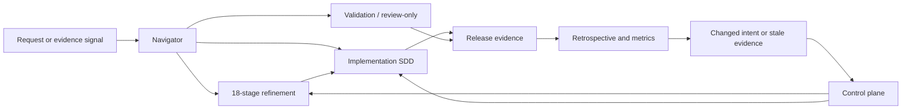

# Workflow map

The map has four connected lanes. Use the earliest lane whose required evidence
is missing; reuse valid upstream work.

## Complete lanes

| Lane | Entry | Capabilities | Completion |
| --- | --- | --- | --- |
| Navigate | Goal known, workflow unclear | Navigator, project context, rigor | Evidence-backed required/optional handoff; no mutation. |
| Refine | Product/business/QA evidence incomplete | Exact 18 stages in [Complete refinement](../flows/refinement.md) | Delivery specification + QA readiness + accepted handoff. |
| Implement | Behavior/design change ready to build | SDD, branching, context, validation, review, security, commit | Bounded task evidence and traceable commits. |
| Control | Change, automation, policy, runtime, portability, operations | Change set, graph, evidence, policy, context v2, runtime, workflow, adapter, doctor, trust, metrics | Explained decision/result with recovery and handoff. |
| Recover/learn | Failed/stale/interrupted/changed outcome | Change impact, resume, migration, retrospective | Authority restored, dependent evidence reopened, proposal governed. |

## Mode semantics

| Mechanism | Scope | Trigger | Does not mean |
| --- | --- | --- | --- |
| `--quick-flow` | One selected skill | Explicit flag | Skip protected gates or hide assumptions. |
| `--full-flow` | One selected skill | Explicit flag | Run all 18 refinement stages automatically. |
| Adaptive rigor | One action/work item | Risk + policy | Give the agent final risk authority. |
| Full refinement | Multi-skill cascade | Explicit end-to-end request/workflow | Every feature must always run every stage. |
| Runtime workflow | Declared task DAG | Valid plan + capabilities | Undeclared shell/network/approval permission. |

## Stable handoff rule

Every skill reports result, blockers, required next action, optional next
actions, reasons, invocations, and expected artifacts. A downstream consumer
checks the evidence again; it does not trust a previous chat's completion claim.

See [Workflow journeys](../flows/index.md) for decision guidance and the
[complete skill catalog](skills.md) for exact capability contracts.
