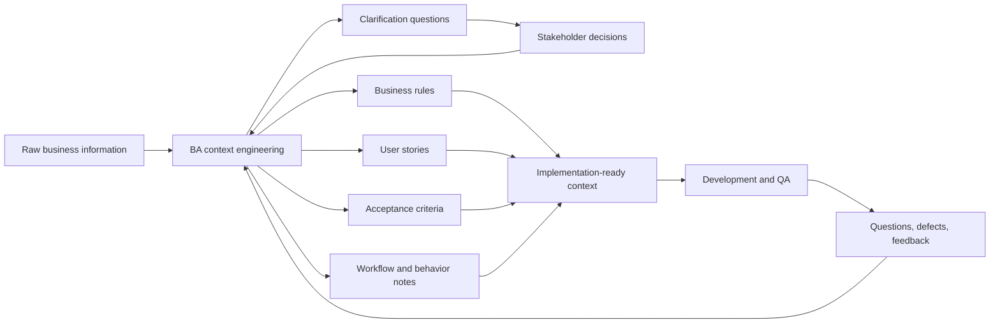
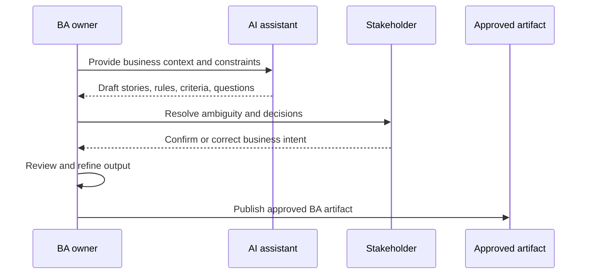

# AI-Ready BA Component

## Purpose

The BA component defines how Business Analysis operates inside the AI-ready delivery workflow.

BA is responsible for transforming fragmented business information into validated engineering context. That context is then represented through implementation-ready artifacts used by developers, QA, AI systems, and future project changes.

## BA Mandate

BA owns business-side context quality before and during implementation.

The BA role is not limited to writing requirements. It continuously:

- analyzes raw business information;
- identifies missing or conflicting context;
- resolves ambiguity with stakeholders;
- defines business rules and expected behavior;
- clarifies implementation boundaries from a business perspective;
- prepares business-oriented engineering artifacts;
- maintains business context as the implemented system evolves.

## Information Sources

Every functional change begins with information, not necessarily with a formal requirement.

Typical sources include:

- customer specifications;
- project management systems;
- Slack or Microsoft Teams discussions;
- stakeholder meetings;
- email communication;
- design mockups;
- support requests;
- production issues;
- existing functionality;
- previously implemented features;
- existing engineering artifacts.

At this stage, information is input to context engineering. It is not yet an implementation requirement.

## Context Engineering Responsibilities

Context engineering is the central BA activity in this model. It begins with the first business signal and continues until the related change has been implemented, validated, and reflected in maintained artifacts.

BA continuously:

- consolidates fragmented business information;
- identifies missing business context;
- validates assumptions;
- identifies dependencies;
- identifies business rules;
- identifies edge cases;
- defines expected behavior;
- clarifies non-goals and implementation boundaries;
- communicates with stakeholders;
- refines context based on new information.

Engineering context is expected to evolve as implementation progresses. Developer questions, testing results, stakeholder feedback, and defect analysis all contribute to further refinement.

## BA Context Flow

## BA Skill Selection

Use these skills by skill name for BA work:

| BA activity | Primary skills | Use when |
| --- | --- | --- |
| Early discovery | `ai-sdlc-working-backwards-discovery` | The customer problem, audience, value proposition, MVP, risks, or success metrics need structured clarification. |
| Business package synthesis | `ai-sdlc-prfaq-package-synthesis` | Discovery is complete and a PRFAQ, FAQ package, or BRD needs to be created. |
| Delivery package gap review | `ai-sdlc-delivery-package-gap-review` | A PRFAQ, BRD, or discovery package must be checked for contradictions, missing business rules, or weak implementation detail. |
| Requirements readiness review | `ai-sdlc-requirements-readiness-review` | PRFAQ and BRD need final readiness scoring before design or development starts. |
| Goal, capability, and epic mapping | `ai-sdlc-goal-capability-and-epic-mapping` | Business goals and roles need to become capabilities and outcome-oriented epics. |
| Backlog requirement review | `ai-sdlc-backlog-requirements-gap-review` | Initiative artifacts need review for missing actors, unclear scope, weak priorities, or backlog-blocking ambiguity. |
| Backlog decomposition | `ai-sdlc-backlog-decomposition-and-task-planning` | Goals, capabilities, and epics need to become features, stories, acceptance summaries, and delivery tasks. |
| User story decomposition | `ai-sdlc-user-story-decomposition` | A clarified initiative package needs epics, stories, acceptance criteria, scenario coverage, and priority signals. |
| BA context engineering | `ai-sdlc-ba` | A feature or change needs actors, workflows, business rules, assumptions, acceptance criteria, and richer spec context. |
| Delivery spec synthesis | `ai-sdlc-delivery-spec-synthesis` | Stories and clarified delivery context are ready to become a structured delivery specification. |
| SDD alignment | `ai-sdlc-sdd` | The change is medium or large and must move through spec-driven development with requirements, design, tests, tasks, implementation, and validation. |

## BA Artifact Generation

BA generates or approves the business-oriented artifacts required to support implementation and validation.

Typical BA-owned or BA-reviewed artifacts include:

- user stories;
- acceptance criteria;
- business rules;
- functional behavior descriptions;
- workflow descriptions;
- decision records;
- supporting documentation;
- traceability notes back to the originating business request.

Artifacts should describe expected system behavior and implementation boundaries. They should remain concise, consistent, traceable, and implementation-ready.

## AI-Assisted BA Workflow

AI may assist BA by:

- consolidating fragmented information;
- summarizing stakeholder discussions;
- analyzing existing artifacts;
- identifying inconsistencies;
- proposing clarification questions;
- identifying potential edge cases;
- drafting user stories and acceptance criteria;
- drafting business rule catalogs;
- proposing artifact updates after approved changes.

BA remains responsible for reviewing, refining, and approving all AI-generated outputs before publication.

The BA review cycle is:

## Development Collaboration

Development begins after the required engineering artifacts are approved. BA continues participating during implementation because context engineering does not stop at handoff.

BA supports development by:

- answering business behavior questions;
- clarifying acceptance criteria;
- validating implementation assumptions;
- resolving stakeholder-level ambiguity;
- refining engineering context when new information appears;
- updating artifacts when approved requirement changes occur.

Developer questions are a source of additional engineering context. They should be captured and used to improve artifacts instead of being treated as one-off chat answers.

## BA Quality Checklist

Before artifacts are considered ready for implementation, BA should verify that:

- the originating business request is clear;
- business goals and expected outcomes are explicit;
- in-scope and out-of-scope behavior is defined;
- acceptance criteria are testable;
- business rules are explicit and not hidden in prose;
- edge cases and exception paths are captured;
- dependencies and assumptions are visible;
- terminology is consistent with existing project artifacts;
- stakeholder decisions are reflected in the latest artifact version;
- AI-generated content was reviewed and approved by a human owner.

## BA Maintenance Rules

BA-owned context must evolve together with the implemented system.

Artifacts should be updated when:

- stakeholder decisions change expected behavior;
- development discovers missing or conflicting context;
- validation reveals unclear or incorrect acceptance criteria;
- a defect exposes an undocumented business rule;
- implemented behavior differs from the original artifact and the difference is approved;
- existing artifacts become obsolete or misleading.

The maintained artifact should describe the current approved system behavior, not only the historical request.
