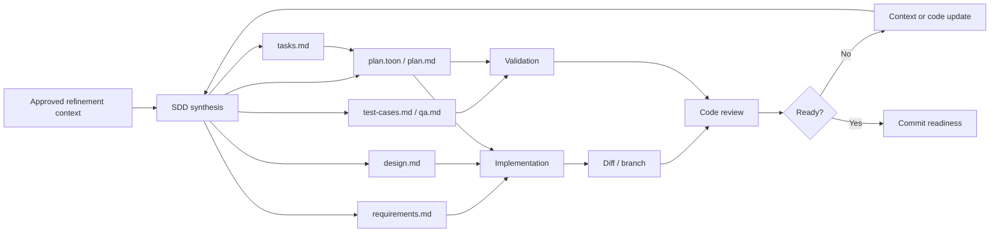
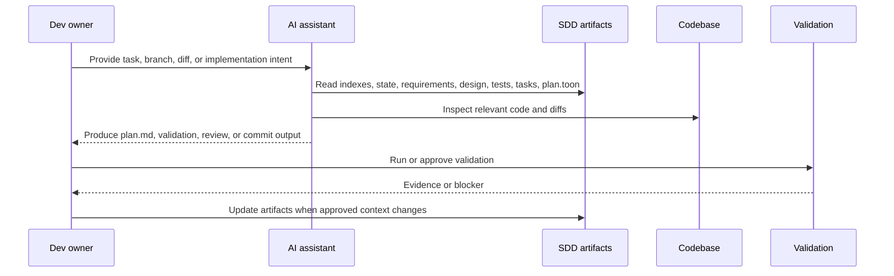

<!-- public-docs-canonical: ../docs/index.md -->

> **Internal, non-canonical design note.** The maintained public documentation starts at [AI SDLC Harness docs](../docs/index.md). This file is retained for repository history and maintainer context only.

# AI-Ready Dev Component

## Purpose

The Dev component defines how implementation work operates inside the AI-ready
software delivery workflow.

Dev is responsible for turning approved engineering context into working,
validated software. The AI assistant supports Dev by reading refinement and SDD
artifacts, producing implementation-ready specs, selecting validation, reviewing
diffs, and preserving traceability through commit preparation.

## Dev Mandate

Dev owns implementation quality and technical correctness.

The Dev role is not limited to writing code. It continuously:

- verifies that implementation work has approved context;
- converts refinement artifacts into implementation SDD artifacts;
- designs changes within explicit scope;
- implements against requirements, acceptance criteria, and test cases;
- validates behavior with deterministic checks;
- reviews diffs for regressions, security risks, and scope drift;
- records implementation decisions and validation evidence;
- keeps artifacts aligned with the implemented system.

## Information Sources

Implementation work should start from approved artifacts rather than scattered
chat context.

Typical Dev sources include:

- `specs-refiniment/<feature-name>/` refinement artifacts;
- `specs/<feature-name>/` SDD artifacts;
- `decision-log.md`;
- `state.toon`;
- `specs-index.toon`;
- source code and tests;
- API contracts;
- database migrations;
- provider documentation;
- validation logs;
- code review findings;
- branch and commit history.

The AI assistant reads indexes first, then opens only the artifacts and code
needed for the implementation task.

## Implementation Context Responsibilities

Implementation context is the Dev-owned layer that connects approved product,
BA, and QA context to code.

Dev continuously:

- confirms requirements are implementable;
- identifies technical constraints and tradeoffs;
- maps acceptance criteria to implementation tasks;
- defines design boundaries;
- updates implementation specs when approved behavior changes;
- keeps tasks tied to requirements and test cases;
- runs or selects validation;
- records implementation decisions;
- reports context gaps back to PM, BA, QA, or Delivery.

Implementation questions are not just code questions. When they reveal unclear
business behavior, missing acceptance criteria, or weak testability, they should
trigger artifact refinement.

## Dev Context Flow

## Dev Skill Selection

The AI assistant selects these skills for Dev work:

| Dev activity | Primary skills | AI-produced output |
| --- | --- | --- |
| SDD package creation | `ai-sdlc-sdd` | Requirements, design, test cases, QA notes, implementation tasks, `plan.toon`, and `plan.md` under `specs/<feature-name>/`. |
| Branch discipline | `ai-sdlc-branching` | Branch plan, task alignment, and branch/spec consistency notes. |
| Validation planning | `ai-sdlc-validation` | Focused validation plan and command selection. |
| Code review | `ai-sdlc-code-review` | Findings-first review against specs, tests, contracts, security, and scope. |
| Security testing | `ai-sdlc-security-testing` | Security review, abuse cases, trust-boundary notes, and validation gaps. |
| Commit readiness | `ai-sdlc-commit-prep` | Staging and commit readiness summary with validation evidence. |
| Conventional commit | `ai-sdlc-conventional-commit` | Conventional Commit message with traceability metadata when required. |
| Sandbox approvals | `ai-sdlc-approvals-sandbox` | Approval plan for escalated commands or sandbox constraints. |

## Dev Artifact Generation

Dev generates or approves implementation-oriented artifacts required to build,
validate, review, and ship a change.

Typical Dev-owned or Dev-reviewed artifacts include:

- `requirements.md`;
- `design.md`;
- `test-cases.md`;
- `qa.md`;
- `tasks.md`;
- `plan.toon`;
- `plan.md`;
- validation plan;
- code review report;
- security review;
- branch plan;
- commit readiness summary;
- commit message.

The AI assistant writes implementation artifacts under `specs/<feature-name>/`.
Generated artifacts include metadata, metatags, decision-log links, lifecycle
state, and specs-index coverage.

## AI-Assisted Dev Workflow

AI may assist Dev by:

- reading refinement and implementation indexes;
- converting approved refinement context into SDD artifacts;
- identifying missing implementation requirements;
- drafting design options and tradeoffs;
- mapping requirements to tasks and tests;
- selecting validation commands;
- reviewing diffs against the SDD package;
- identifying regression and security risks;
- preparing commit metadata and traceability links;
- proposing artifact updates after approved implementation clarifications.

Dev remains responsible for reviewing, correcting, and accepting all AI-produced
implementation outputs before code is merged or shipped.

The Dev review cycle is:

## Development Collaboration

Dev depends on upstream roles and feeds new context back to them.

Dev collaborates with:

- PM when implementation tradeoffs affect product value, scope, or release
  slicing;
- BA when business behavior, workflow, rules, or acceptance criteria are unclear;
- QA when scenarios, regression scope, test data, or validation evidence are
  incomplete;
- Delivery when sequencing, ownership, rollout, or handoff risk changes;
- Security reviewers when trust boundaries, authorization, secrets, or abuse
  cases are involved.

Questions discovered during implementation should update artifacts or decision
logs. They should not remain only as comments in a PR.

## Quick Flow For Dev

In quick flow, the AI can produce focused implementation support when the change
is small, localized, low risk, or already well specified.

Quick flow is appropriate for:

- small bug fixes;
- localized refactors;
- focused validation selection;
- commit message drafting;
- lightweight branch checks;
- narrow code review on a small diff.

The AI records assumptions and reports skipped broader checks as residual risk.

## Full Flow For Dev

In full flow, the AI verifies predecessor refinement artifacts, SDD completeness,
decision traceability, test coverage, validation evidence, and implementation
scope before final handoff.

Full flow is appropriate for:

- medium or large implementation work;
- API, provider, auth, data, or security-sensitive changes;
- architecture changes;
- release-critical validation;
- final review before merge;
- commit preparation for traceability-sensitive work.

## Dev Quality Checklist

Before implementation work is considered ready, Dev should verify that:

- requirements and acceptance criteria are explicit;
- design choices and tradeoffs are documented;
- tasks map to requirements and tests;
- implementation stays within SDD scope;
- validation commands were run or blockers are documented;
- code review findings are resolved or explicitly accepted;
- security risks are reviewed when relevant;
- decision-log entries exist for material implementation choices;
- artifacts reflect approved behavior after implementation changes;
- AI-produced output was reviewed and accepted by Dev.

## Dev Maintenance Rules

Dev-owned context must evolve with the codebase.

Artifacts should be updated when:

- implementation reveals missing requirements;
- design changes from the original plan;
- validation exposes incomplete test coverage;
- code review finds scope drift;
- security review changes implementation constraints;
- accepted behavior differs from the original artifact;
- tasks are completed or reprioritized;
- commit or release evidence needs traceability.

Maintained Dev artifacts should describe the current implemented and validated
system, not only the initial implementation plan.
