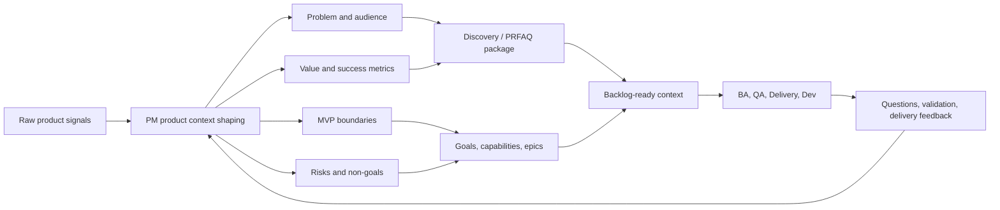
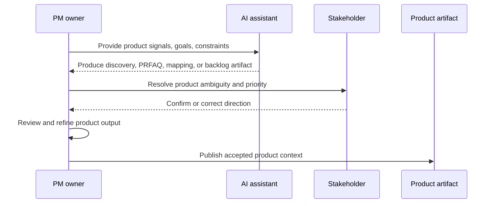

<!-- public-docs-canonical: ../docs/index.md -->

> **Internal, non-canonical design note.** The maintained public documentation starts at [AI SDLC Harness docs](../docs/index.md). This file is retained for repository history and maintainer context only.

# AI-Ready PM Component

## Purpose

The PM component defines how Product Management operates inside the AI-ready
software delivery workflow.

PM is responsible for product intent, customer value, prioritization, MVP
boundaries, and outcome clarity. The AI assistant transforms PM-provided context
into structured refinement artifacts that BA, QA, Delivery, Dev, and future AI
agents can reuse.

## PM Mandate

PM owns product-side direction and outcome quality before a feature becomes
delivery work.

The PM role is not limited to writing a product brief. It continuously:

- analyzes customer and business signals;
- clarifies the problem, audience, and value proposition;
- defines MVP and release boundaries;
- identifies non-goals and product risks;
- aligns stakeholders around scope and priority;
- maps business goals to capabilities, epics, and backlog-ready work;
- reviews AI-produced product artifacts before they become delivery context;
- maintains product context as decisions evolve.

## Information Sources

Every product change begins with signals that may not yet be formal
requirements.

Typical PM sources include:

- customer interviews;
- sales or support feedback;
- stakeholder requests;
- roadmap notes;
- product analytics;
- competitive analysis;
- discovery workshops;
- strategy documents;
- PRFAQ drafts;
- design explorations;
- incident or churn signals;
- existing refinement artifacts.

At this stage, information is product context. The AI assistant structures it
into artifacts, but PM still decides whether the result reflects the intended
product direction.

## Product Context Responsibilities

Product context is the PM-owned input that lets BA, QA, Delivery, and Dev
understand why a feature matters and what outcome it must produce.

PM continuously:

- consolidates fragmented product signals;
- distinguishes customer need from proposed solution;
- clarifies user segments and affected roles;
- defines value, success metrics, and expected outcomes;
- sets MVP boundaries and release slices;
- captures product assumptions;
- identifies open product decisions;
- resolves stakeholder conflicts;
- records durable choices in `decision-log.md`;
- updates product artifacts when strategy, priority, or scope changes.

Developer and QA questions often reveal missing product context. Those questions
should feed back into PM-owned artifacts instead of remaining only in chat or
tickets.

## PM Context Flow

## PM Skill Selection

The AI assistant selects these skills for PM work:

| PM activity | Primary skills | AI-produced output |
| --- | --- | --- |
| Early discovery | `ai-sdlc-working-backwards-discovery` | Structured discovery notes covering problem, audience, value, MVP, risks, and success metrics. |
| PRFAQ and product package | `ai-sdlc-prfaq-package-synthesis` | PRFAQ, FAQ package, or BRD-style product context from validated discovery notes. |
| Delivery package gap review | `ai-sdlc-delivery-package-gap-review` | Gap review for contradictions, missing business rules, weak implementation detail, or handoff risk. |
| Requirements readiness | `ai-sdlc-requirements-readiness-review` | Readiness score and blockers before downstream design, QA, backlog, or implementation work. |
| Goal and capability mapping | `ai-sdlc-goal-capability-and-epic-mapping` | Business goals, capabilities, roles, and outcome-oriented epics. |
| Backlog requirement review | `ai-sdlc-backlog-requirements-gap-review` | Planning-gap review for missing actors, unclear scope, weak priorities, or backlog blockers. |
| Backlog decomposition | `ai-sdlc-backlog-decomposition-and-task-planning` | Feature breakdown, story candidates, acceptance summary, and cross-functional delivery tasks. |
| Release slicing | `ai-sdlc-release-slicing-and-backlog-readiness-review` | MVP/release slices, sequencing, dependency notes, and readiness risks. |
| Delivery handoff review | `ai-sdlc-delivery-handoff-review` | Final readiness review before engineering or cross-functional handoff. |

## PM Artifact Generation

PM generates or approves product-oriented artifacts required for downstream
delivery.

Typical PM-owned or PM-reviewed artifacts include:

- discovery notes;
- PRFAQ or FAQ package;
- product brief;
- goal and capability map;
- epic map;
- backlog decomposition;
- release slicing notes;
- product risks and non-goals;
- success metrics;
- stakeholder decision records.

The AI assistant writes these artifacts under
`specs-refiniment/<feature-name>/`. Generated artifacts include metadata,
metatags, decision-log links, and specs-index coverage.

## AI-Assisted PM Workflow

AI may assist PM by:

- consolidating customer and stakeholder signals;
- separating problem statements from proposed solutions;
- identifying missing audience, value, MVP, and success metric context;
- drafting discovery questions;
- synthesizing PRFAQ or BRD-style packages;
- mapping goals to capabilities and epics;
- proposing backlog slices;
- identifying release sequencing risks;
- updating artifacts after approved product decisions.

PM remains responsible for reviewing, correcting, and accepting all AI-produced
product artifacts before they become delivery input.

The PM review cycle is:

## PM Collaboration

PM-owned product context feeds the rest of the delivery system.

PM collaborates with:

- BA to convert product direction into business rules, workflows, assumptions,
  and acceptance criteria;
- QA to ensure value, risk, and expected behavior are testable;
- Delivery to confirm scope, readiness, sequencing, and ownership;
- Dev to clarify product intent when implementation tradeoffs appear;
- stakeholders to resolve scope, priority, and release decisions.

When downstream teams discover missing product context, PM should update the
product artifacts or record a decision instead of leaving the clarification only
in a meeting or chat thread.

## Quick Flow For PM

In quick flow, the AI produces a useful draft from available product context
without blocking on every missing optional detail.

Quick flow is appropriate for:

- early discovery;
- first-pass PRFAQ drafts;
- summarizing stakeholder notes;
- backlog exploration;
- low-risk release slicing;
- preparing material for PM review.

The AI records assumptions and keeps unknowns visible.

## Full Flow For PM

In full flow, the AI treats missing product decisions as blockers when they
affect scope, audience, value, MVP, success metrics, release boundaries, or
downstream delivery confidence.

Full flow is appropriate for:

- stakeholder signoff;
- handoff to BA, QA, Delivery, or Dev;
- release planning;
- readiness reviews;
- scope-sensitive prioritization;
- roadmap-impacting decisions.

## PM Quality Checklist

Before artifacts are considered ready for downstream use, PM should verify that:

- the customer or business problem is explicit;
- the target audience or user segment is clear;
- value and expected outcome are stated;
- success metrics or observable signals are defined when available;
- MVP scope is separated from later scope;
- non-goals are visible;
- product risks and assumptions are documented;
- dependencies and stakeholder decisions are traceable;
- priority and release intent are understandable;
- AI-produced content was reviewed and accepted by PM.

## PM Maintenance Rules

PM-owned context must evolve when product direction changes.

Artifacts should be updated when:

- stakeholders change priority or scope;
- success metrics change;
- MVP boundaries move;
- delivery feedback exposes missing product context;
- QA finds untestable value or behavior statements;
- Dev identifies implementation tradeoffs that affect product behavior;
- release sequencing changes;
- product assumptions become confirmed, rejected, or superseded.

Maintained PM artifacts should describe the current accepted product direction,
not only the first request.
