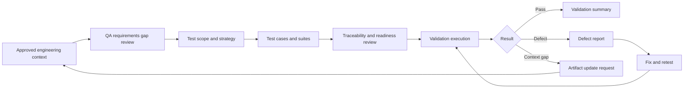
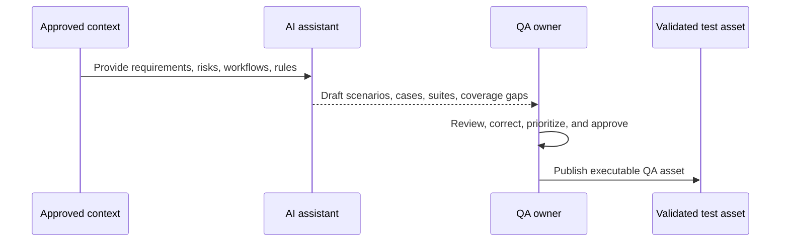

<!-- public-docs-canonical: ../docs/index.md -->

> **Internal, non-canonical design note.** The maintained public documentation starts at [AI SDLC Harness docs](../docs/index.md). This file is retained for repository history and maintainer context only.

# AI-Ready QA Component

## Purpose

The QA component defines how Quality Assurance operates inside the AI-ready delivery workflow.

QA is responsible for validating that implemented functionality conforms to approved engineering artifacts and for continuously improving engineering context when testing reveals missing assumptions, unclear behavior, or coverage gaps.

## QA Mandate

QA participates from the earliest stage of every functional change.

The goal is to validate business intent, acceptance criteria, implementation boundaries, and testability before development begins. QA is not only a post-development validation function. QA is an active owner of engineering context quality.

QA continuously:

- reviews requirements and artifacts for testability;
- identifies missing scenarios and edge cases;
- defines validation strategy and test scope;
- generates and maintains testing artifacts;
- validates implementation against approved artifacts;
- reports defects with context and traceability;
- updates or requests updates to artifacts when validation reveals missing context.

## QA First Responsibilities

Before implementation starts, QA should verify that:

- the functional change has approved engineering context;
- acceptance criteria are testable;
- expected behavior is explicit;
- business rules are available and unambiguous;
- negative, boundary, and edge cases are considered;
- impacted areas and regression risks are identified;
- test assets can be generated from the available context;
- unclear behavior is raised before development begins.

## QA Artifact Generation

QA generates or approves the validation artifacts required to confirm implemented behavior.

Typical QA-owned or QA-reviewed artifacts include:

- test cases;
- regression checklists;
- API validation assets;
- exploratory testing charters;
- business rule verification checklists;
- defect reports;
- coverage gap notes;
- validation summaries.

Testing artifacts should be traceable to approved engineering context and should evolve when that context changes.

## QA Validation Flow

## QA Skill Selection

Use these skills by skill name for QA work:

| QA activity | Primary skills | Use when |
| --- | --- | --- |
| QA planning and validation | `ai-sdlc-qa` | QA planning, acceptance validation, regression scope, exploratory checks, smoke tests, release verification, or manual validation evidence are needed. |
| QA requirements gap review | `ai-sdlc-qa-requirements-gap-review` | Stories, specs, BRDs, APIs, workflows, or delivery artifacts need review for testability, missing business rules, unclear behavior, scope ambiguity, and QA blockers. |
| Test scope and strategy | `ai-sdlc-test-scope-and-strategy-design` | Requirements are testable enough to define coverage priorities, suite intent, test data, environment dependencies, and risk-based execution focus. |
| Test case design | `ai-sdlc-test-cases` | Test cases, test plans, or expanded coverage are needed from explicit scenarios before implementing unit, service, transport, or integration tests. |
| Test suite synthesis | `ai-sdlc-test-case-and-suite-synthesis` | Detailed executable test cases plus smoke, regression, and UAT suites need to be tied to requirements, roles, workflows, and risks. |
| QA traceability and readiness | `ai-sdlc-qa-traceability-and-readiness-review` | Requirements-to-test traceability, missing coverage, QA blockers, and execution readiness need to be reviewed after strategy and test-case synthesis. |
| Security testing | `ai-sdlc-security-testing` | OWASP review, abuse-case analysis, authn/authz review, input validation review, secret exposure review, or endpoint/workflow security validation is needed. |
| Backend and API validation | `ai-sdlc-validation` | Go, SQL, API, provider integration, SDD, or documentation changes need focused deterministic checks. |
| Code review support | `ai-sdlc-code-review` | A diff, PR, branch, commit, staged change, or completed implementation needs review against SDD requirements, tests, API contracts, security, and scope discipline. |
| Delivery handoff review | `ai-sdlc-delivery-handoff-review` | Story and spec synthesis are complete and readiness for engineering or cross-functional execution must be scored. |

## Validation Lifecycle

Validation confirms that implemented functionality conforms to approved engineering artifacts.

Testing is also an extension of context engineering. Validation frequently reveals missing assumptions, undocumented business rules, unclear acceptance criteria, or opportunities to improve artifacts.

Typical validation activities include:

- functional validation;
- API validation;
- regression testing;
- business rule verification;
- exploratory testing;
- defect reporting.

When new information is discovered, QA should first determine whether the engineering context requires refinement before treating the issue only as an implementation defect.

Bug fixing is another iteration of context engineering. Approved clarifications and corrections should update the affected artifacts.

## AI-Assisted QA Workflow

AI may assist QA by:

- generating test scenarios from approved artifacts;
- identifying missing negative or edge cases;
- identifying coverage gaps;
- drafting regression checklists;
- drafting API validation collections or request outlines;
- assisting defect analysis;
- generating bug report drafts;
- proposing updates to affected artifacts after approved clarification.

QA remains responsible for reviewing, refining, and approving all AI-generated testing outputs before publication or execution.

The QA review cycle is:

## Defect Handling

Defects should preserve traceability to engineering context.

A high-quality defect report should include:

- observed behavior;
- expected behavior;
- reference to the relevant artifact or acceptance criterion;
- reproduction steps;
- environment or data conditions;
- impact assessment;
- evidence when available;
- context gap or artifact update recommendation, if applicable.

If a defect reveals missing or incorrect context, QA should request artifact refinement instead of allowing the clarification to remain only in the defect discussion.

## QA Quality Checklist

Before validation starts, QA should verify that:

- test cases trace back to approved user stories, acceptance criteria, or business rules;
- positive, negative, boundary, and edge scenarios are represented;
- regression impact is understood;
- API and integration behavior is covered when relevant;
- data setup and environment assumptions are explicit;
- expected results are specific enough to evaluate;
- AI-generated scenarios were reviewed by QA;
- known context gaps are documented and escalated.

## QA Maintenance Rules

QA artifacts should be updated when:

- acceptance criteria change;
- business rules change;
- implementation behavior changes through approved clarification;
- defects expose missing scenarios;
- regression coverage becomes outdated;
- API behavior or contracts change;
- exploratory testing discovers a reusable validation scenario.

Maintained QA artifacts should represent the current implemented and approved behavior, not only the original test plan.
