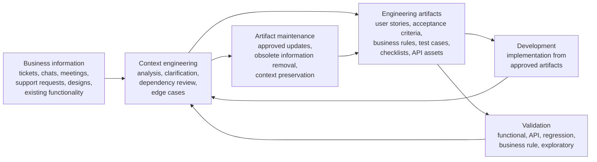
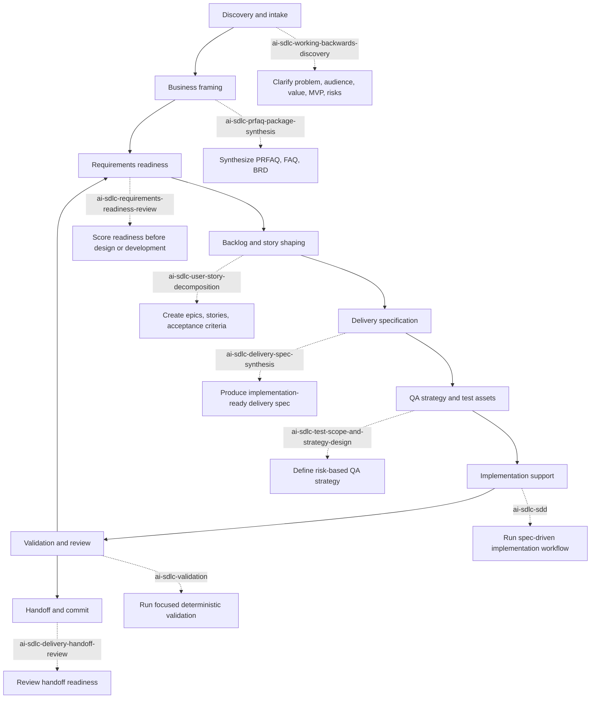
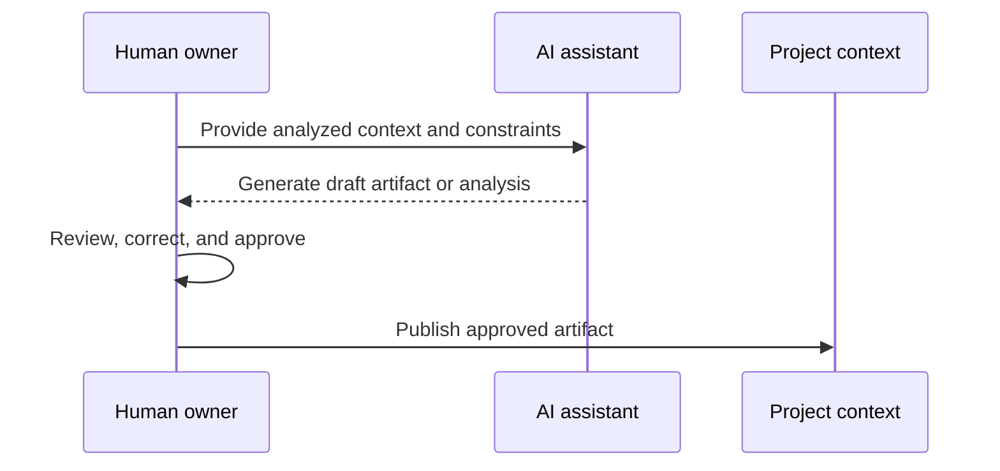

# AI-Ready QA/BA Workflow

## Purpose

Modern AI coding assistants increase engineering productivity only when they operate inside a well-structured engineering environment. Most software projects distribute critical context across tickets, chats, meetings, documentation, source code, and undocumented implementation decisions. As a result, AI systems often spend effort reconstructing context instead of solving engineering problems.

This workflow defines an AI-ready QA/BA operating model. It restructures QA and Business Analysis activities around the continuous creation, validation, and maintenance of engineering context.

Engineering context is progressively transformed into structured engineering artifacts that become the primary source of information for developers, AI systems, QA, BA, and future project changes.

The model is technology-independent and can be applied regardless of business domain, architecture, delivery methodology, or AI platform.

## Goals

The workflow is designed to:

- establish an AI-ready QA/BA process;
- standardize the transformation of business information into engineering context;
- improve requirement quality before implementation begins;
- integrate AI into everyday QA/BA activities;
- establish specification-driven development;
- maintain engineering artifacts throughout the software lifecycle;
- reduce dependency on undocumented engineering decisions;
- improve consistency between business intent, implementation, and validation.

## Scope

This workflow defines how QA and Business Analysis activities should support AI-assisted software delivery.

It covers:

- information analysis;
- context engineering;
- engineering artifact generation;
- collaboration with development;
- test engineering;
- feature validation;
- engineering artifact maintenance.

It does not define software architecture, development practices, project management methodologies, release management, DevOps processes, or AI platform selection. Those areas should be governed by separate engineering standards.

## Operating Principles

### QA First

QA/BA participates from the earliest stage of every functional change. The objective is to validate and refine business intent before implementation begins instead of validating completed functionality only after development.

### Context Before Development

Every functional change must be transformed into complete and validated engineering context before implementation begins. Engineering artifacts are the primary mechanism for capturing and communicating this context.

### AI Augmentation

AI is integrated into activities where information is analyzed, engineering context is refined, or engineering artifacts are produced. AI accelerates engineering work but does not replace engineering judgment.

### Human Ownership

QA/BA remains responsible for engineering decisions, artifact quality, and engineering context. AI-generated outputs require human review and approval before they become part of the project.

### Specification-Driven Development

Development begins from approved engineering artifacts, not fragmented communication or undocumented assumptions. Engineering artifacts provide a consistent implementation reference for both developers and AI systems.

### Continuously Maintained Artifacts

Engineering artifacts evolve together with the software throughout its lifecycle. Every approved functional change should be reflected in the corresponding artifacts so they remain accurate, consistent, and useful for future AI-assisted development.

### Continuous Context Refinement

Engineering context is continuously refined throughout the feature lifecycle. Questions raised during development, testing, and bug fixing are treated as opportunities to improve context, not as isolated implementation issues.

## Operating Model

Within this model, QA/BA owns engineering context throughout the lifecycle of every functional change.

QA/BA is not limited to requirement documentation or feature validation. The primary responsibility is to transform fragmented business information into implementation-ready engineering context and maintain that context throughout delivery.

The model has four fundamental responsibilities:

1. **Context engineering**: analyze business requests, identify missing information, resolve ambiguities, define implementation boundaries, identify dependencies, and establish complete engineering context before development begins.
2. **Engineering artifact generation**: transform validated context into standardized artifacts suitable for implementation, validation, and future maintenance.
3. **Development and validation support**: clarify requirements, refine context when new information appears, validate completed functionality against approved artifacts, and document implementation gaps.
4. **Engineering artifact maintenance**: update artifacts so they accurately reflect implemented functionality and remain useful for future project changes.

## Context Flow

This workflow is built around continuous evolution of engineering context rather than sequential project phases.

Key flow rules:

- business information may originate from any source;
- context engineering is a continuous QA/BA activity throughout the feature lifecycle;
- engineering artifacts represent the current state of engineering context;
- development and validation continuously refine both the context and its artifacts;
- AI augments each stage while engineering ownership remains with QA/BA.

## Skill Flow

Use the repository skills as the execution layer for this workflow. The skills should be selected by lifecycle stage, not loaded all at once.

## Skill Selection Map

Use these skills by skill name when executing this operating model:

| Workflow stage | Primary skills | Use when |
| --- | --- | --- |
| Discovery | `ai-sdlc-working-backwards-discovery` | The customer problem, audience, value proposition, MVP, risks, or success metrics are not yet clear. |
| PRFAQ and requirements package | `ai-sdlc-prfaq-package-synthesis` | Working-backwards discovery is complete and a PRFAQ, FAQ package, or BRD is needed. |
| Delivery package review | `ai-sdlc-delivery-package-gap-review` | A PRFAQ, BRD, or discovery package exists and needs review for contradictions, missing business rules, or insufficient handoff detail. |
| Requirements readiness | `ai-sdlc-requirements-readiness-review` | PRFAQ and BRD are ready for strict quality review before design or development starts. |
| Goal and epic mapping | `ai-sdlc-goal-capability-and-epic-mapping` | Business goals, roles, capabilities, and outcome-oriented epics need to be mapped before detailed backlog work. |
| Backlog readiness | `ai-sdlc-backlog-requirements-gap-review` | Initiative artifacts need review for planning gaps, weak priorities, missing actors, or backlog-blocking ambiguity. |
| Backlog decomposition | `ai-sdlc-backlog-decomposition-and-task-planning` | Goals, capabilities, and epics need to become features, stories, acceptance summaries, and delivery tasks. |
| Story decomposition | `ai-sdlc-user-story-decomposition` | A clarified initiative package needs epics, user stories, acceptance criteria, scenario coverage, and priority signals. |
| Release slicing | `ai-sdlc-release-slicing-and-backlog-readiness-review` | Backlog needs MVP/release slices, sequencing, traceability, and planning readiness scoring. |
| BA context engineering | `ai-sdlc-ba` | A feature or change needs actors, workflows, business rules, assumptions, acceptance criteria, and richer spec context. |
| Delivery spec | `ai-sdlc-delivery-spec-synthesis` | Stories and clarified delivery context are ready for implementation-ready specification synthesis. |
| Spec-driven development | `ai-sdlc-sdd` | A medium or large feature, refactor, API change, architecture change, or provider integration must follow requirements, design, tests, tasks, implementation, and validation. |
| QA planning | `ai-sdlc-qa` | QA planning, acceptance validation, regression scope, exploratory checks, smoke tests, or release verification are needed. |
| QA gap review | `ai-sdlc-qa-requirements-gap-review` | Stories, specs, BRDs, APIs, or workflows need review for testability and QA-blocking gaps before tests are generated. |
| Test strategy | `ai-sdlc-test-scope-and-strategy-design` | Requirements are testable enough to define QA scope, priorities, strategy, data, environments, and risk focus. |
| Test cases | `ai-sdlc-test-cases` and `ai-sdlc-test-case-and-suite-synthesis` | Test cases, smoke suites, regression suites, or UAT suites need to be generated from explicit scenarios and requirements. |
| QA traceability | `ai-sdlc-qa-traceability-and-readiness-review` | Requirements-to-test traceability, missing coverage, blockers, and QA execution readiness need review. |
| Security validation | `ai-sdlc-security-testing` | Auth, authorization, input validation, secret exposure, abuse cases, endpoints, or workflows need security-focused testing. |
| Implementation branch discipline | `ai-sdlc-branching` | Implementation work starts, a task branch must be created or verified, or branch/spec alignment must be checked. |
| Validation | `ai-sdlc-validation` | Go, SQL, API, provider integration, SDD, or documentation changes need focused deterministic checks. |
| Code review | `ai-sdlc-code-review` | A diff, PR, branch, commit, staged change, or completed implementation needs review against requirements, tests, API contracts, security, and scope. |
| Delivery handoff | `ai-sdlc-delivery-handoff-review` | Story and spec synthesis are complete and strict handoff readiness must be scored. |
| Commit preparation | `ai-sdlc-commit-prep` and `ai-sdlc-conventional-commit` | Repository changes need staging, auditable commit message preparation, SDD traceability, or Conventional Commit validation. |
| Sandbox and approvals | `ai-sdlc-approvals-sandbox` | Escalated permissions, sandbox failures, command approval rules, or command safety decisions need to be handled. |

## End-to-End Lifecycle

1. **Intake information**: collect raw business, product, support, design, and implementation signals.
2. **Analyze context**: identify gaps, ambiguities, dependencies, business rules, implementation boundaries, and edge cases.
3. **Clarify open questions**: resolve missing or conflicting information with stakeholders, developers, and existing artifacts.
4. **Generate artifacts**: create the artifacts needed for implementation and validation.
5. **Review and approve**: QA/BA reviews AI-generated or manually drafted artifacts before publication.
6. **Implement from artifacts**: development uses approved artifacts as the primary implementation reference.
7. **Validate behavior**: QA validates implementation against approved artifacts and identifies context gaps.
8. **Refine context**: approved changes, defects, and developer questions update the shared engineering context.
9. **Maintain artifacts**: artifacts are updated so they describe the implemented system, not only historical intent.

## Engineering Artifacts

Engineering artifacts are the primary representation of engineering context. They are not documentation for documentation's sake. Their objective is to provide a consistent, reusable source of information for developers, QA/BA, AI systems, and future project changes.

Typical artifacts include:

- user stories;
- acceptance criteria;
- business rules;
- test cases;
- checklists;
- API collections and validation assets;
- bug reports;
- supporting documentation.

Each artifact should have:

- a clearly defined purpose;
- a standardized structure;
- an owner responsible for quality;
- a maintenance process;
- traceability to the originating business request.

Projects should adopt only the artifacts that provide measurable value while maintaining consistency across the engineering process.

## AI Integration Model

AI is embedded throughout the QA/BA workflow rather than introduced as a standalone tool.

AI assists with:

- context analysis;
- inconsistency and missing-information detection;
- clarification question generation;
- engineering artifact generation;
- testing asset generation;
- defect analysis;
- artifact maintenance.

The standard interaction pattern is:

AI-generated content must never become part of the project without QA/BA review and approval.

## Artifact Quality Standards

Every engineering artifact should be:

- **Complete**: contains enough information to support implementation and validation without undocumented assumptions.
- **Consistent**: does not contradict related artifacts, existing functionality, or approved business rules.
- **Traceable**: maintains a clear relationship with the originating business request and related artifacts.
- **Maintainable**: can be updated without complete recreation.
- **AI-consumable**: uses consistent structure and terminology that engineers and AI systems can interpret.

Artifacts that fail these standards should be refined before becoming part of the project's engineering context.

## Adoption Guidelines

Introduce the workflow incrementally. Process consistency should come before expanding AI capabilities.

Recommended adoption sequence:

1. Introduce QA First principles.
2. Standardize context engineering activities.
3. Standardize engineering artifact templates.
4. Introduce AI-assisted artifact generation.
5. Introduce AI-assisted testing workflows.
6. Establish continuous artifact maintenance.
7. Expand AI participation across the complete QA/BA lifecycle.

Successful adoption depends primarily on engineering context maturity and process consistency, not on AI tooling alone.
