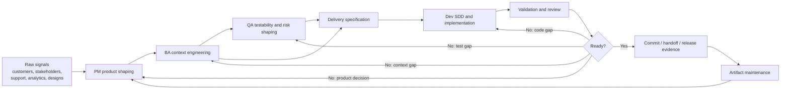
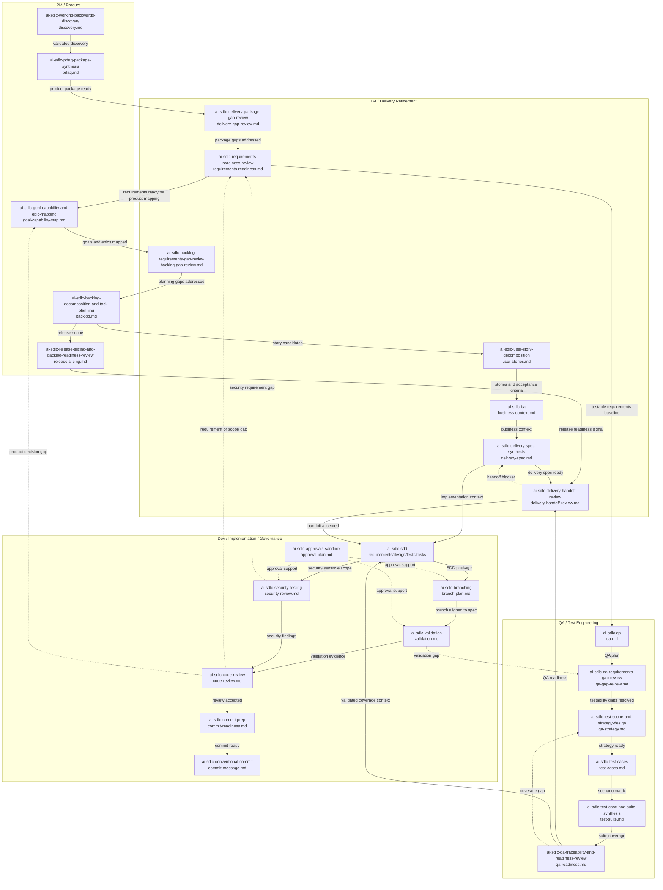
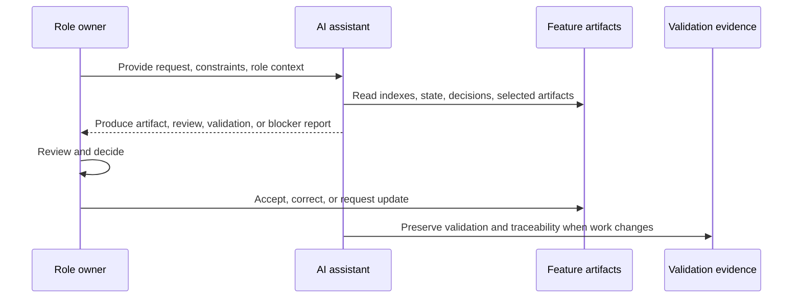

<!-- public-docs-canonical: ../docs/index.md -->

> **Internal, non-canonical design note.** The maintained public documentation starts at [AI SDLC Harness docs](../docs/index.md). This file is retained for repository history and maintainer context only.

# AI-Ready Delivery Workflow

## Purpose

This guide explains the end-to-end role workflow for the AI SDLC Harness.
It shows how PM, BA, QA, Dev, Delivery, and the AI assistant cooperate to turn
fragmented context into traceable delivery artifacts and validated software.

The workflow is not a replacement for team ownership. It is a structured way for
the AI assistant to read context, produce artifacts, preserve decisions, and keep
work reusable across the software lifecycle.

## Workflow Mandate

The workflow exists to make AI-assisted software delivery reliable.

The AI assistant participates across the lifecycle by:

- reading the smallest relevant context set;
- selecting the current role skill;
- producing structured artifacts;
- maintaining decision traceability;
- updating lifecycle state;
- refreshing indexes for future agents;
- surfacing blockers instead of hiding them;
- keeping PM, BA, QA, and Dev outputs separated by workspace.

Humans remain accountable for decisions, approvals, implementation quality, and
release readiness.

## Role Model

Each role owns a different slice of context.

| Role | Owns | AI-produced support |
| --- | --- | --- |
| PM | Product intent, value, audience, MVP, priority, release scope | Discovery notes, PRFAQ package, goal/capability map, backlog slices, release readiness notes |
| BA | Business behavior, workflows, rules, assumptions, acceptance criteria | Business context, requirements readiness, stories, delivery specs, handoff reviews |
| QA | Testability, risk, coverage, scenarios, validation readiness | QA plans, gap reviews, test strategy, test cases, suites, traceability review |
| Dev | Implementation correctness, design, code, validation, review, commits | SDD package, branch plan, validation plan, code review, security review, commit readiness |
| Delivery | Sequencing, ownership, handoff quality, readiness | Delivery gap reviews, handoff reviews, rollout and blocker visibility |

The AI assistant does not merge these roles into one generic output. It produces
role-specific artifacts and connects them through shared traceability records.

## Context Lifecycle

The workflow is continuous, not a one-way document pipeline.

## AI Operating Pattern

For any durable delivery task, the AI assistant follows the same high-level
pattern:

1. Identifies the active role and skill from the user's request.
2. Reads the relevant role guide when the workflow context is unclear.
3. Uses the selected skill instructions and helper scripts as the operational
   source of truth.
4. Checks the workspace specs index before opening broad feature files.
5. Checks feature lifecycle state when durable feature work is involved.
6. Runs the skill-specific helper script when it can reduce token usage or
   enforce structure.
7. Produces the routed artifact under `specs-refiniment/` or `specs/`.
8. Updates artifact metadata, decision log, lifecycle state, and specs index
   when durable files change.
9. Reports blockers, assumptions, validation evidence, and residual risk.

The `concepts/` folder explains how the system works for maintainers and teams.
It is documentation for understanding the harness, not a required runtime input
for every AI task.

This pattern keeps the AI from re-reading unnecessary files and keeps generated
outputs traceable for the next role.

## End-To-End Flow

### 1. Product Shaping

PM provides product signals: customer problem, audience, value, constraints,
goals, priorities, MVP boundaries, or release pressure.

The AI assistant produces PM-oriented refinement artifacts:

- discovery notes;
- PRFAQ / product package;
- goal and capability map;
- backlog decomposition;
- release slicing or readiness notes.

The output lives in `specs-refiniment/<feature-name>/` and becomes upstream
context for BA and QA.

### 2. Business Context Engineering

BA turns product direction into implementation-ready business context.

The AI assistant produces or reviews:

- business context;
- business rules;
- actors and workflows;
- assumptions and open questions;
- acceptance criteria;
- delivery specification;
- handoff readiness.

BA artifacts make expected behavior explicit enough for QA to test and Dev to
implement.

### 3. QA Testability And Coverage

QA validates whether the available context can support reliable testing.

The AI assistant produces or reviews:

- QA plan;
- requirements gap review;
- test strategy;
- test cases;
- test suites;
- QA traceability and readiness review;
- security testing notes when relevant.

QA outputs connect requirements, risks, and validation expectations before and
after implementation.

### 4. Delivery Handoff

Delivery checks whether the package is ready for engineering or cross-functional
execution.

The AI assistant identifies:

- missing ownership;
- incomplete acceptance criteria;
- unresolved decisions;
- sequencing risks;
- QA or Dev blockers;
- artifacts that must be updated before handoff.

This step prevents incomplete context from becoming implementation debt.

### 5. Spec-Driven Development

Dev converts approved refinement context into implementation artifacts under
`specs/<feature-name>/`.

The AI assistant produces or updates:

- `requirements.md`;
- `design.md`;
- `test-cases.md`;
- `qa.md`;
- `tasks.md`;
- `plan.toon`;
- `plan.md`;
- validation plans;
- code-review artifacts;
- security-review artifacts;
- commit readiness notes.

The AI uses `plan.toon` as the compact machine plan for task state,
dependencies, trace IDs, and validation order. It produces `plan.md` as the
human-readable view and refreshes it when TOON task status changes. Implementation
should stay within the accepted SDD scope. If implementation discovers missing
behavior, the workflow loops back to PM, BA, or QA depending on the gap.

### 6. Validation, Review, And Commit

The AI assistant supports Dev and QA by selecting validation commands, reviewing
diffs, checking traceability, and preparing commit metadata.

Validation output should explain:

- what was checked;
- which requirement, acceptance, or test IDs were covered;
- which checks failed or were skipped;
- what residual risk remains;
- whether artifacts need updates.

### 7. Artifact Maintenance

After implementation, approved changes are reflected back into artifacts.

The AI assistant updates or recommends updates when:

- product scope changes;
- business behavior changes;
- validation exposes missing scenarios;
- implementation differs from the original plan;
- decisions are accepted, superseded, or rejected;
- artifacts become stale.

Maintained artifacts describe the current accepted system behavior, not only the
historical request.

## Skill Flow Map

The diagram below shows every skill in the library and the role that primarily
uses it. Some skills can support more than one role, but each node is placed in
the role lane that usually owns the output.

## Skill Ownership Map

| Role lane | Skills |
| --- | --- |
| Cross-lifecycle navigation | `ai-sdlc-navigator` |
| PM / Product | `ai-sdlc-working-backwards-discovery`, `ai-sdlc-prfaq-package-synthesis`, `ai-sdlc-goal-capability-and-epic-mapping`, `ai-sdlc-backlog-decomposition-and-task-planning`, `ai-sdlc-release-slicing-and-backlog-readiness-review` |
| BA / Delivery Refinement | `ai-sdlc-delivery-package-gap-review`, `ai-sdlc-requirements-readiness-review`, `ai-sdlc-backlog-requirements-gap-review`, `ai-sdlc-user-story-decomposition`, `ai-sdlc-ba`, `ai-sdlc-delivery-spec-synthesis`, `ai-sdlc-delivery-handoff-review` |
| QA / Test Engineering | `ai-sdlc-qa`, `ai-sdlc-qa-requirements-gap-review`, `ai-sdlc-test-scope-and-strategy-design`, `ai-sdlc-test-cases`, `ai-sdlc-test-case-and-suite-synthesis`, `ai-sdlc-qa-traceability-and-readiness-review` |
| Dev / Implementation / Governance | `ai-sdlc-sdd`, `ai-sdlc-branching`, `ai-sdlc-validation`, `ai-sdlc-code-review`, `ai-sdlc-security-testing`, `ai-sdlc-commit-prep`, `ai-sdlc-conventional-commit`, `ai-sdlc-approvals-sandbox` |

## Skill Selection Map

| Workflow stage | Primary skills | AI-produced output |
| --- | --- | --- |
| Navigation / resume | `ai-sdlc-navigator` | Read-only detected context, required and optional next actions, exact invocations, expected artifacts, and blockers. |
| Product discovery | `ai-sdlc-working-backwards-discovery` | Discovery notes with problem, audience, value, MVP, risks, and success metrics. |
| PRFAQ / product package | `ai-sdlc-prfaq-package-synthesis` | PRFAQ, FAQ package, or BRD-style product package. |
| Delivery package gap review | `ai-sdlc-delivery-package-gap-review` | Gap review before stories, specs, or handoff. |
| Requirements readiness | `ai-sdlc-requirements-readiness-review` | Readiness score, blockers, and missing context. |
| Goal / capability / epic map | `ai-sdlc-goal-capability-and-epic-mapping` | Business goals, capabilities, roles, and epics. |
| Backlog review | `ai-sdlc-backlog-requirements-gap-review` | Backlog-planning gap review. |
| Backlog decomposition | `ai-sdlc-backlog-decomposition-and-task-planning` | Features, story candidates, acceptance summary, delivery tasks. |
| Story decomposition | `ai-sdlc-user-story-decomposition` | Epics, stories, acceptance criteria, scenario coverage. |
| Release slicing | `ai-sdlc-release-slicing-and-backlog-readiness-review` | MVP/release slices, sequencing, readiness risks. |
| BA context | `ai-sdlc-ba` | Business context, rules, actors, workflows, assumptions, acceptance criteria. |
| Delivery spec | `ai-sdlc-delivery-spec-synthesis` | Implementation-ready delivery specification. |
| QA planning | `ai-sdlc-qa` | QA plan, regression scope, validation notes. |
| QA gap review | `ai-sdlc-qa-requirements-gap-review` | Testability gaps and QA blockers. |
| Test strategy | `ai-sdlc-test-scope-and-strategy-design` | QA strategy, suite intent, data and environment needs. |
| Test cases | `ai-sdlc-test-cases` | Scenario matrix and test cases. |
| Test suite | `ai-sdlc-test-case-and-suite-synthesis` | Smoke, regression, UAT, and detailed test suites. |
| QA traceability | `ai-sdlc-qa-traceability-and-readiness-review` | Coverage gaps, traceability matrix, readiness review. |
| Delivery handoff | `ai-sdlc-delivery-handoff-review` | Final handoff readiness review. |
| SDD | `ai-sdlc-sdd` | Requirements, design, tests, QA notes, and tasks under `specs/`. |
| Branching | `ai-sdlc-branching` | Branch plan and branch/spec alignment. |
| Validation | `ai-sdlc-validation` | Focused validation command plan and evidence summary. |
| Code review | `ai-sdlc-code-review` | Findings-first review against specs, tests, contracts, security, and scope. |
| Security testing | `ai-sdlc-security-testing` | Security review, abuse cases, trust-boundary and validation gaps. |
| Commit readiness | `ai-sdlc-commit-prep` | Staging, validation, and commit-readiness summary. |
| Commit message | `ai-sdlc-conventional-commit` | Conventional Commit message with traceability metadata when needed. |
| Sandbox approvals | `ai-sdlc-approvals-sandbox` | Approval plan for escalated commands or sandbox limitations. |

## Quick Flow In The Workflow

In quick flow, the AI assistant keeps the workflow moving with available
evidence.

Quick flow produces:

- draft artifacts;
- visible assumptions;
- decision-log rows for material assumptions;
- focused validation;
- residual-risk notes;
- refreshed indexes when files change.

Quick flow is appropriate for early shaping, low-risk updates, small changes, or
drafting before human review.

## Full Flow In The Workflow

In full flow, the AI assistant prioritizes verification and handoff confidence.

Full flow produces:

- blocker lists for missing material context;
- verified artifact references;
- decision-log coverage;
- lifecycle-state checks;
- validation evidence;
- refreshed TOON and Markdown specs indexes;
- explicit readiness or non-readiness.

Full flow is appropriate before signoff, handoff, implementation, merge, release,
or any decision-sensitive work.

## Human Review Model

The AI assistant can produce drafts, checks, summaries, and recommendations.
Humans accept or reject product direction, business decisions, QA readiness,
implementation choices, and release decisions.

## Workflow Quality Bar

A feature is AI-ready when:

- product intent is clear;
- business behavior is explicit;
- acceptance criteria are testable;
- QA coverage is traceable;
- implementation scope is defined;
- decisions are recorded;
- lifecycle state is current;
- generated artifacts have metadata;
- specs indexes point to the latest artifacts;
- validation evidence exists or blockers are explicit.

When any of these are missing, the workflow loops back to the role that owns the
missing context.
