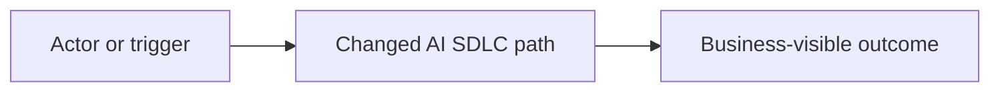
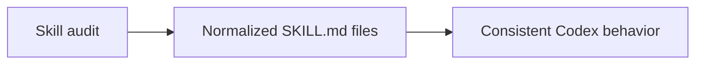

# AI SDLC Conventional Commit

## Purpose

Draft, validate, or repair an AI SDLC commit message that uses Conventional Commit syntax and includes SDD, Asana, business, implementation, testing, and validation traceability when the change is medium, large, or Asana-linked.

## Inputs

- Collect the intended change type: `feat`, `fix`, `docs`, `test`, `refactor`, `chore`, `ci`, `build`, `perf`, or `revert`.
- Collect the optional scope when it adds useful precision, for example `api`, `bitgo`, `sdd`, `codex`, or `docs`.
- Collect the active spec folder for medium or large work, for example `specs/177-codex-skill-instruction-upgrade`.
- Collect the related Asana task GID and URL when one exists.
- Collect the implementation summary, reviewer-visible test path, and exact validation commands with outcomes.
- Collect breaking-change details when behavior, schema, API contract, migration requirements, or compatibility changes are not backward compatible.

## Steps

1. Write the subject as `type(scope): imperative summary` or `type: imperative summary`.
2. Keep the subject under 72 characters unless a longer subject prevents ambiguity.
3. Use a lowercase type and lowercase kebab-case scope.
4. Use an imperative summary, for example `fix bitgo wallet routing`, not `fixed bitgo wallet routing`.
5. Add `Asana: task_gid URL` when the work is linked to Asana.
6. Add `Spec: specs/NNN-feature-name` for medium or large work.
7. Add `Business context`, `Implementation details`, `Mermaid diagram`, `How to test`, and `Validation` sections for medium, large, or Asana-linked work.
8. Add `BREAKING CHANGE:` when the change requires a migration, client update, data backfill, or operator action.
9. Validate the message before committing:

   ```bash
   python3 .codex/skills/ai-sdlc-conventional-commit/scripts/validate_commit_msg.py path/to/message.txt --require-traceability
   ```

10. Fix every validator error before using the message.

## Output Spec

Return a complete commit message, not a paragraph about the message:

````text
type(scope): imperative summary

Asana: task_gid https://app.asana.com/...

Spec: specs/NNN-feature-name

Business context:
One or two sentences explaining why the change matters to product, operations, risk, clients, QA, or delivery governance.

Implementation details:
- Concrete code, contract, doc, workflow, provider, schema, or validation changes.
- Important compatibility, rollout, or failure-mode decisions.

Mermaid diagram:


How to test:
1. Reviewer-visible happy path or documentation path.
2. Important permission, failure, boundary, regression, or governance path.

Validation:
- command -> outcome
````

Quality gate:

- Pass when the subject is Conventional Commit compliant, traceability is present when required, validation commands are exact, and every required body section contains concrete project-specific content.
- Fail when the message uses placeholders, omits required traceability, hides failed validation, or describes implementation in vague terms such as "updated stuff" or "improved docs".

## Examples

Valid medium-change message:

````text
docs(codex): upgrade repo-local skill instructions

Asana: 1215001164529861 https://app.asana.com/1/1203386629993561/project/1213092419088959/task/1215001164529861

Spec: specs/177-codex-skill-instruction-upgrade

Business context:
This makes Codex skill usage deterministic for future AI SDLC work and reduces reviewer effort caused by vague skill outputs.

Implementation details:
- Rewrote every repo-local skill with Purpose, Inputs, Steps, Output spec, Examples, Edge cases, and Scope boundary.
- Added a skill index that maps each workflow phase to the correct skill.

Mermaid diagram:


How to test:
1. Read a cold skill and confirm it contains a complete execution contract.
2. Run skill and spec validators for the updated files.

Validation:
- python3 .codex/scripts/quick_validate_skill.py .codex/skills/ai-sdlc-workflow -> passed
- git diff --check -> passed
````

Invalid counter-example:

```text
updates

Made skills better.
```

Reject this because the subject is not Conventional Commit syntax, traceability is absent, and validation evidence is missing.

## Edge Cases

- Write `Asana: none found` only when the spec documents the searches performed and why task creation was skipped.
- Omit the Asana line for small local-only changes with no ticket and no traceability requirement.
- Include `BREAKING CHANGE:` even for documentation-only commits when the documented workflow intentionally retires a previously required control.
- Use `revert: ...` only when the commit actually reverts a previous commit; include the reverted hash in the body.
- Stop and fix the message when the validator fails; do not commit with an invalid message.
- State failed or skipped validation honestly in the `Validation` section with the residual risk.

## Scope Boundary

- Do not stage files or create commits; use `$ai-sdlc-commit-prep` for staging and commit execution.
- Do not search, create, or move Asana tasks; use `$ai-sdlc-asana-traceability`.
- Do not invent validation results; use `$ai-sdlc-validation` to choose and run checks.
- Do not use this skill to summarize a diff unless the output is a commit message.
